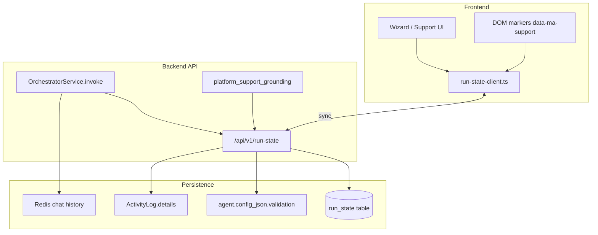

# Phase 1 Implementation Plan — Operation Ground Truth

**Project:** manage-agent  
**Mission:** Stop agents from guessing; route work by precision; earn autonomy instead of granting it.  
**Status:** M1 (Run State) + M2 backend (Precision Routing) implemented — uncommitted in working tree  
**Estimated duration:** 3–4 weeks (1 engineer), or 2 weeks with parallel FE/BE tracks

---

## Executive summary

1. **Run State** — Introduce a single authoritative state object for wizard/support flows and invoke-scoped agent runs. DB/API wins over URL, session, and LLM prose.
2. **Precision Routing** — Replace scattered keyword gates with explicit `execution_precision` tiers (deterministic / guided / autonomous) wired through `OrchestratorService`.
3. **Graduated Autonomy** — Four levels (L0–L3) for platform support automation; default L1; L3 gated by success history.
4. **Reuse, don’t replatform** — Extend `config_json`, `ActivityLog`, existing bridges, and `platform_support_grounding` — no Hermes, no LangGraph rewrite.
5. **Ship behind flags** — `run_state_v1`, `precision_routing_v1`, `graduated_autonomy_v1` for safe rollout.

---

## Architecture (target)



---

## Phase 0: Documentation discovery (complete)

### Allowed APIs & patterns (copy from these)

| Pattern | Source | Use for |
|---------|--------|---------|
| `config_json.runtime_plan` | `agent_runtime_prepare_service.py` L35–37 | Precision routing metadata |
| `config_json.validation` phases | `agent_validation_service.py` L94–102, L265–278 | Agent publish run state |
| Thread ID format | `orchestrator_service.py` L220 | Run state scope |
| Support thread IDs | `support-chat.ts` L36–49 | Wizard session scope |
| Wizard phase detection | `support-wizard-mission.ts` L36–70, `support-page-state.ts` | FE phase sync |
| Authoritative context block | `page-guide-context.ts` L172–194 | Inject run state |
| Worker auto-tool bypass | `orchestrator_service.py` L529–693 | P0 deterministic path |
| Kind capability clamping | `agent_capabilities.py` L46–106 | Default precision by kind |
| Grounding retry | `graph_agent.py` L230–376 | Support tool forcing |
| Execution trace steps | `execution_trace.py` | Observability |

### Anti-patterns (do NOT)

- Trust LLM-generated slugs or “Suggested ID” UI text as persisted state
- Call `clearStaleWizardCreatedSlug()` from `wizard.create` bridge
- Treat `wizard-name-slug-preview` as a UI blocker
- Use Tailwind color classes for wizard step index (use `aria-current="step"`)
- Add global `gitignore lib/` that hides `frontend/src/lib/`
- Keyword routing (`_karkard_words`) for new code — use `execution_precision` + `runtime_plan`

---

## Milestone 1: Run State (week 1) — ✅ DONE

### 1.1 Data model

**New table:** `run_state`

```sql
CREATE TABLE run_state (
  id UUID PRIMARY KEY DEFAULT gen_random_uuid(),
  scope_type VARCHAR(32) NOT NULL,  -- 'wizard' | 'support' | 'invoke'
  scope_key VARCHAR(512) NOT NULL,  -- thread_id or wizard_session_id
  user_id UUID NOT NULL REFERENCES users(id),
  agent_id UUID NULL REFERENCES agents(id),
  slug VARCHAR(255) NULL,
  phase VARCHAR(32) NOT NULL DEFAULT 'unknown',
  wizard_step_index INT NULL,
  payload JSONB NOT NULL DEFAULT '{}',
  version INT NOT NULL DEFAULT 1,
  created_at TIMESTAMPTZ NOT NULL DEFAULT now(),
  updated_at TIMESTAMPTZ NOT NULL DEFAULT now(),
  UNIQUE(scope_type, scope_key)
);
CREATE INDEX idx_run_state_user ON run_state(user_id);
CREATE INDEX idx_run_state_slug ON run_state(slug) WHERE slug IS NOT NULL;
```

**`phase` enum:**  
`wizard_form` | `wizard_steps` | `publish` | `planning` | `training` | `dashboard` | `validation` | `complete` | `error`

**`payload` JSON (structured, not prose):**

```json
{
  "agent_slug_verified": true,
  "last_tool": "platform_continue_agent_testing",
  "last_tool_success": true,
  "attempt_counts": { "continue_testing": 2 },
  "user_choices": { "skip_widget_stat_cards": false },
  "autonomy_level": 1,
  "execution_precision": "guided",
  "source_of_slug": "api|url|session"
}
```

**Alternative considered:** extend only `config_json.validation` — rejected for support threads (no agent row yet at step 1) and cross-session support. Dedicated table is cleaner.

### 1.2 Backend API

**File:** `backend/src/api/v1/run_state.py` (new)  
**Service:** `backend/src/services/run_state_service.py` (new)  
**Schemas:** `backend/src/schemas/run_state.py` (new)

| Method | Path | Description |
|--------|------|-------------|
| GET | `/api/v1/run-state/{scope_type}/{scope_key}` | Read state (404 → empty default) |
| PUT | `/api/v1/run-state/{scope_type}/{scope_key}` | Upsert with optimistic `version` |
| PATCH | `/api/v1/run-state/{scope_type}/{scope_key}` | Merge payload fields |
| DELETE | `/api/v1/run-state/{scope_type}/{scope_key}` | Clear on wizard abandon |

**Rules (enforce in service, not prompts):**

1. `slug` may only be set when `verify_agent_exists(slug)` returns true OR after `createAgent` API success
2. Clearing slug requires explicit `DELETE` or phase → `wizard_form` with admin flag
3. `wizard_step_index` from client must be ignored if DOM markers contradict (server trusts FE snapshot in observation messages only as hint)

**Hook points:**

- After agent publish in wizard page → PATCH slug + phase=`training`
- After `platform_continue_agent_testing` tool success → PATCH phase
- After validation complete → phase=`complete`

### 1.3 Frontend client

**File:** `frontend/src/lib/run-state-client.ts` (new)

```typescript
// Copy patterns from support-chat.ts session merge + support-wizard-mission session keys
export type RunStateScope = { type: 'wizard' | 'support' | 'invoke'; key: string };
export async function getRunState(scope: RunStateScope): Promise<RunState>;
export async function patchRunState(scope: RunStateScope, patch: Partial<RunStatePayload>): Promise<RunState>;
export function wizardScopeKey(): string; // active support thread or ma_wizard_session id
```

**Migration from sessionStorage:**

- `ma_wizard_created_slug` → read-through cache; write always goes to API first
- On load: merge API state over session; if conflict, API wins

### 1.4 Context injection

**Update:** `frontend/src/lib/page-guide-context.ts`

Add block (machine-readable):

```
[RUN STATE — AUTHORITATIVE — DO NOT GUESS]
phase: training
slug: yjnt-jdyd-21 (verified: true, source: api)
wizard_step: 5/6
autonomy_level: 2
allowed_tools: platform_continue_agent_testing
FORBIDDEN: platform_create_agent
```

**Update:** `backend/src/agents_lib/platform_support_grounding.py`

Parse `[RUN STATE` block; if `phase` in training|dashboard|validation → hard rule in retry hints.

### 1.5 Bridge integration

| File | Change |
|------|--------|
| `use-wizard-support-bridge.ts` | On publish success → `patchRunState({ slug, phase: 'training' })` |
| `use-testing-support-bridge.ts` | Start → read slug from run state, not payload |
| `platform-support-assistant.tsx` | Before `runUiOutcome` → fetch run state; after success → patch |
| `support-wizard-heal.ts` | Use run state phase instead of only DOM when available |

### 1.6 Verification (Milestone 1) — ✅ DONE

- [x] Unit: `RunStateService` slug verification rejects unverified slugs (`tests/unit/test_run_state_service.py`)
- [x] Unit: priority API > URL > session — `run-state-client.ts` read-through, `getRunState` API-wins (`run-state-client.test.ts`)
- [x] Integration: publish agent → PATCH run state with verified slug + `phase=training` (`use-wizard-support-bridge.ts`, `agents/create/page.tsx`)
- [x] Manual: “Continue” on step 1 never sends `continue_testing` without verified slug — slug read from run-state-backed session / verified via `agentExists`
- [x] Grep guard: publish/continue paths PATCH `run-state` API alongside `sessionStorage` write (no bare `readCreatedAgentSlug()` without fallback)

---

## Milestone 2: Precision Routing (week 2) — backend ✅ DONE (frontend M2c pending)

### 2.1 Schema

**Add to Agent model** (`backend/src/models/agent.py` + Alembic):

```python
class ExecutionPrecision(str, enum.Enum):
    DETERMINISTIC = "deterministic"  # P0
    GUIDED = "guided"              # P1
    AUTONOMOUS = "autonomous"      # P2
```

Store in `config_json.execution_precision` (no column initially — faster ship).

**Defaults by kind** (`agent_capabilities.py` or new `precision_defaults.py`):

| AgentKind | Default | Notes |
|-----------|---------|-------|
| WORKER | deterministic | karkard, run_agent_script |
| CHAT | autonomous | ReAct full |
| SUPERVISOR | guided | router + limited tools |
| CUSTOM | guided | wizard picks |

### 2.2 Routing table

**New file:** `backend/src/core/execution_router.py`

```python
def resolve_execution_path(agent: Agent, payload: AgentInvokeRequest) -> ExecutionPath:
    """
    Returns: AUTO_TOOL | REACT | SUPERVISOR | PLAIN_LLM
    """
```

**Decision matrix:**

| Precision | chat_enabled | action_slug | primary_tool | Path |
|-----------|--------------|-------------|--------------|------|
| deterministic | * | set | run_agent_script | AUTO_TOOL |
| deterministic | * | set | karkard_process | REACT (tool call required — existing rule) |
| deterministic | false | * | run_agent_script | AUTO_TOOL |
| guided | true | — | * | REACT (restricted tools) |
| autonomous | true | — | * | REACT or SUPERVISOR |

**Refactor:** Move `_karkard_words` check behind `precision == GUIDED` escape hatch only; document why karkard stays LLM-mediated.

### 2.3 Orchestrator changes

**File:** `backend/src/services/orchestrator_service.py`

Replace inline branching at L246–280 with:

```python
path = resolve_execution_path(agent, payload)
if path == AUTO_TOOL:
    auto = await self._try_worker_auto_tool(...)
    if auto: return auto
if path == SUPERVISOR and caps.get("supervisor_enabled"):
    ...
# REACT fallback
```

Add `execution_path` to `execution_trace` first step.

### 2.4 Wizard UI

**File:** `frontend/src/app/(dashboard)/agents/create/page.tsx` (or wizard kind step)

Three cards (Persian):

| UI Label | Precision | Helper text |
|----------|-----------|-------------|
| قطعی — مثل کارکرد | deterministic | Same input → same output; best for payroll/Excel rules |
| هدایت‌شده | guided | AI with limits; human review recommended |
| خودکار | autonomous | Full tool access; higher risk |

Store in create payload → `config_json.execution_precision`.

### 2.5 Admin override

**File:** `frontend/src/app/(dashboard)/admin/agents/page.tsx`

Show precision badge; allow admin edit with warning for deterministic agents.

### 2.6 Verification (Milestone 2) — backend ✅ DONE

- [x] `test_karkard_never_uses_worker_auto_tool` still passes — karkard stays REACT (tool-call required) in `execution_router`
- [x] New: worker+deterministic+script → AUTO_TOOL without LLM (`test_execution_router.py` matrix)
- [x] New: chat+autonomous → ReAct invoked (via `resolve_execution_path`)
- [x] Trace includes `execution_path` field (first `trace_step` in `orchestrator_service.invoke_with_agent`)
- [x] No regression on `test_orchestrator_file_context.py` (orchestrator unit suite green)

---

## Milestone 3: Graduated Autonomy (week 3) — ⏳ NOT STARTED

### 3.1 Levels

| Level | Key | Support behavior | Wizard behavior |
|-------|-----|------------------|-----------------|
| L0 | `observe` | Text suggestions only | No `runUiOutcome` |
| L1 | `assist` | Highlight/fill; user confirms | Default for new users |
| L2 | `auto` | Run bridges; pause on blockers | Default for admins |
| L3 | `unattended` | Full pipeline until validation | Gated |

**Storage:**

- User preference: `users.preferences_json.support_autonomy_level` (default 1)
- Session override: `run_state.payload.autonomy_level`
- Org default: platform setting `default_support_autonomy_level`

### 3.2 Gating L3

**File:** `backend/src/services/autonomy_policy_service.py` (new)

L3 allowed if:

- User is superuser, OR
- Agent has `validation.ok == true` count ≥ 3 in last 30 days, OR
- Explicit org feature flag

### 3.3 Frontend enforcement

**File:** `platform-support-assistant.tsx`

```typescript
function canRunAutomation(level: AutonomyLevel, action: 'suggest' | 'fill' | 'bridge' | 'full'): boolean
```

| Action | L0 | L1 | L2 | L3 |
|--------|----|----|----|-----|
| suggest | ✓ | ✓ | ✓ | ✓ |
| fill | | ✓ | ✓ | ✓ |
| bridge | | | ✓ | ✓ |
| full unattended | | | | ✓ |

**Local continue path** (`resolveLocalWizardContinueScript`): requires ≥ L2.

### 3.4 UX

- Settings page toggle with Persian descriptions
- Support panel shows current level badge
- When blocked: “برای اجرای خودکار، سطح خودمختاری را در تنظیمات افزایش دهید”
- Audit: `ActivityLog` action `autonomy_escalation` when user bumps level mid-session

### 3.5 Verification (Milestone 3)

- [ ] L0: send “continue” → LLM prose only, no UI script
- [ ] L1: fill name field suggestion, no auto-publish
- [ ] L2: continue on testing phase runs `continue_testing` bridge
- [ ] L3: blocked for new user without validation history
- [ ] E2E Playwright (optional): one wizard happy path at L2

---

## Milestone 4: Integration, flags, polish (week 4) — ⏳ NOT STARTED

### 4.1 Feature flags

**File:** `backend/src/config.py` + env

```
RUN_STATE_V1=true
PRECISION_ROUTING_V1=true
GRADUATED_AUTONOMY_V1=true
```

Frontend: read from `/api/v1/platform/settings` or build-time env.

### 4.2 Debug panel (stretch)

Admin page `/admin/support-debug`:

- List active run states for user
- Show phase, slug, autonomy, last tool
- “Reset run state” button

### 4.3 Timeline UI (stretch)

Wizard sidebar: vertical timeline of phases with timestamps from run state PATCH history (optional `run_state_events` table).

### 4.4 Migration & backfill

- Alembic migration for `run_state` table
- No backfill required — empty state on first load
- Deprecation notice in code comments for direct `sessionStorage` slug writes

### 4.5 Final verification

- [ ] Full manual wizard: create → train → dashboard → validate without duplicate agent
- [ ] Support “continue” at each phase
- [ ] Worker karkard agent still processes Excel correctly
- [ ] `pytest backend/tests/unit/test_run_state*.py` (new suite)
- [ ] `vitest frontend/src/lib/run-state-client.test.ts`
- [ ] graphify update after merge

---

## File change summary

### New files

| Path | Purpose |
|------|---------|
| `backend/alembic/versions/*_run_state.py` | Migration |
| `backend/src/models/run_state.py` | ORM |
| `backend/src/schemas/run_state.py` | Pydantic |
| `backend/src/services/run_state_service.py` | Business logic |
| `backend/src/api/v1/run_state.py` | REST |
| `backend/src/core/execution_router.py` | Precision routing |
| `backend/src/services/autonomy_policy_service.py` | L3 gating |
| `backend/tests/unit/test_run_state_service.py` | Tests |
| `backend/tests/unit/test_execution_router.py` | Tests |
| `frontend/src/lib/run-state-client.ts` | API client |
| `frontend/src/lib/run-state-client.test.ts` | Tests |
| `frontend/src/lib/autonomy-policy.ts` | FE level checks |

### Modified files (primary)

| Path | Change |
|------|--------|
| `orchestrator_service.py` | Use execution_router |
| `graph_agent.py` | Parse run state in grounding |
| `platform_support_grounding.py` | Run state aware retries |
| `page-guide-context.ts` | Authoritative block |
| `platform-support-assistant.tsx` | Autonomy gates |
| `support-wizard-mission.ts` | Delegate slug to run state |
| `use-wizard-support-bridge.ts` | PATCH run state on publish |
| `use-testing-support-bridge.ts` | Read run state slug |
| `agents/create/page.tsx` | Precision selector |
| `agent_capabilities.py` | Default precision |
| `settings/page.tsx` | Autonomy level UI |

---

## Risks & mitigations

| Risk | Impact | Mitigation |
|------|--------|------------|
| Run state out of sync with DOM | Wrong phase | DOM as hint only; API updated on tool success |
| Extra latency on every support message | Slower UX | Cache run state in FE; batch PATCH |
| Precision misconfiguration breaks karkard | Production incident | Default worker→deterministic; integration tests |
| L3 unattended creates bad agents | User trust | Strict gating; audit log; default L1 |
| Migration on busy DB | Downtime | Small table; online migration |

---

## Explicit non-goals (Phase 1)

- External sandbox harness embed (Phase 3 uses in-house Docker only)
- Skill library / failure ledger (Phase 2)
- Replacing LangGraph or supervisor rewrite
- Postgres replacement for Redis chat history
- Public API breaking changes to invoke contract

---

## Execution order for `/do` or new chats

Each bullet = one focused implementation session.

1. **M1a** — Alembic + model + RunStateService + unit tests  
2. **M1b** — API routes + auth (user owns scope_key)  
3. **M1c** — `run-state-client.ts` + wire publish hook in wizard bridge  
4. **M1d** — Context injection + grounding parse + support assistant read/write  
5. **M2a** — `execution_router.py` + tests  
6. **M2b** — Orchestrator refactor + trace field  
7. **M2c** — Wizard precision selector + admin badge  
8. **M3a** — Autonomy policy service + user preference storage  
9. **M3b** — platform-support-assistant gates + settings UI  
10. **M4** — Feature flags, manual QA checklist, graphify update  

---

## Complete Test & Verification Matrix

Every deliverable below must pass before the phase is considered done. Run automated suites in CI; manual rows are required for release sign-off.

**Commands (baseline):**

```bash
cd backend && pytest tests/unit/test_run_state_service.py tests/unit/test_execution_router.py tests/integration/test_run_state_api.py -q
cd frontend && npm run test -- run-state-client autonomy-policy
# Full phase gate:
cd backend && pytest tests/unit/test_run_state*.py tests/unit/test_execution_router.py tests/unit/test_autonomy_policy*.py -q
cd frontend && npm run test -- run-state autonomy-policy support-wizard-mission use-testing-support-bridge
```

---

### Milestone 1 — Run State

#### 1.1 Data model (`run_state` table)

| # | Test | Type | How to verify | Pass criteria |
|---|------|------|---------------|---------------|
| 1.1.1 | Migration applies cleanly | Integration | `alembic upgrade head` on empty + existing DB | No errors; table + indexes exist |
| 1.1.2 | Unique constraint | Unit | Insert duplicate `(scope_type, scope_key)` | Second insert raises integrity error |
| 1.1.3 | Phase enum validation | Unit | `RunStateService` rejects invalid phase | 422 / validation error |
| 1.1.4 | Payload JSON merge | Unit | PATCH merges nested keys without clobber | `attempt_counts` preserved on partial patch |
| 1.1.5 | Nullable slug index | Integration | Query by slug when slug IS NULL | No crash; partial index used |

**Test file:** `backend/tests/unit/test_run_state_service.py`

#### 1.2 Backend API

| # | Test | Type | How to verify | Pass criteria |
|---|------|------|---------------|---------------|
| 1.2.1 | GET empty state | Integration | GET unknown scope | 200 with defaults OR 404 → client default (document chosen behavior) |
| 1.2.2 | PUT upsert | Integration | PUT then GET same scope | Fields match; `version` increments |
| 1.2.3 | Optimistic lock | Integration | PUT with stale `version` | 409 conflict |
| 1.2.4 | Auth: own scope only | Integration | User A reads User B scope | 403 |
| 1.2.5 | Slug verification rule | Unit | PATCH slug without DB agent | Rejected unless `verify_agent_exists` true |
| 1.2.6 | Slug after create API | Integration | Mock publish → PATCH slug | Accepted; `source_of_slug=api` |
| 1.2.7 | DELETE clears state | Integration | DELETE then GET | Empty / 404 |
| 1.2.8 | Unauthenticated | Integration | No token on GET | 401 |

**Test file:** `backend/tests/integration/test_run_state_api.py`

#### 1.3 Frontend client (`run-state-client.ts`)

| # | Test | Type | How to verify | Pass criteria |
|---|------|------|---------------|---------------|
| 1.3.1 | API wins over session | Unit | Mock API slug A, session slug B | Returns A |
| 1.3.2 | Session fallback offline | Unit | API 503, session has slug | Returns session with `verified: false` flag |
| 1.3.3 | `wizardScopeKey()` stable | Unit | Same thread → same key across reload | Key unchanged |
| 1.3.4 | patchRunState optimistic | Unit | Patch failure rolls back local cache | No stale local state |
| 1.3.5 | Write-through on publish | Integration | Publish hook → API called before sessionStorage | API receives slug first |

**Test file:** `frontend/src/lib/run-state-client.test.ts`

#### 1.4 Context injection

| # | Test | Type | How to verify | Pass criteria |
|---|------|------|---------------|---------------|
| 1.4.1 | Authoritative block present | Unit | `buildSupportContextBlock` with run state | Contains `[RUN STATE — AUTHORITATIVE` |
| 1.4.2 | FORBIDDEN tools by phase | Unit | phase=training | Lists `platform_create_agent` in FORBIDDEN |
| 1.4.3 | Grounding parse | Unit | `platform_support_grounding.py` parser | phase training → retry hints forbid create |
| 1.4.4 | No slug when unverified | Unit | slug empty, preview in DOM | Block says `slug: (none verified)` |
| 1.4.5 | graph_agent receives block | Integration | Invoke support with run state header | Tool choice respects phase |

**Test files:** `frontend/src/lib/page-guide-context.test.ts`, `backend/tests/unit/test_platform_support_grounding.py`

#### 1.5 Bridge integration

| # | Test | Type | How to verify | Pass criteria |
|---|------|------|---------------|---------------|
| 1.5.1 | Publish → PATCH | Manual + unit | Complete wizard publish | run state phase=`training`, verified slug |
| 1.5.2 | Testing bridge reads API slug | Unit | `use-testing-support-bridge` mock | Never uses URL-only slug |
| 1.5.3 | Continue blocked step 1 | Unit | `shouldBlockWizardCreateWalk` + run state step 1 | No `continue_testing` |
| 1.5.4 | After continue_testing success | Integration | Tool mock success | phase advances in run state |
| 1.5.5 | support-wizard-heal prefers API | Unit | API phase vs DOM mismatch | API phase wins |
| 1.5.6 | No direct session slug write | Static | Grep `ma_wizard_created_slug` writes | All go through run-state-client |

**Test files:** existing `support-wizard-mission.test.ts`, `use-testing-support-bridge.test.ts`

---

### Milestone 2 — Precision Routing

#### 2.1 Schema (`execution_precision`)

| # | Test | Type | How to verify | Pass criteria |
|---|------|------|---------------|---------------|
| 2.1.1 | Default by kind WORKER | Unit | Create worker without precision | `deterministic` |
| 2.1.2 | Default by kind CHAT | Unit | Create chat | `autonomous` |
| 2.1.3 | Default by kind SUPERVISOR | Unit | Create supervisor | `guided` |
| 2.1.4 | Invalid precision rejected | Unit | API create with `precision=foo` | 422 |
| 2.1.5 | Stored in config_json | Integration | GET agent after create | `config_json.execution_precision` set |

**Test file:** `backend/tests/unit/test_execution_router.py`, `backend/tests/unit/test_agent_capabilities.py`

#### 2.2 Routing table (`execution_router.py`)

| # | Test | Type | How to verify | Pass criteria |
|---|------|------|---------------|---------------|
| 2.2.1 | P0 + run_agent_script | Unit | Matrix row | Returns `AUTO_TOOL` |
| 2.2.2 | P0 + karkard_process | Unit | Matrix row | Returns `REACT` (existing rule) |
| 2.2.3 | P1 + chat_enabled | Unit | No action_slug | Returns `REACT` restricted |
| 2.2.4 | P2 + supervisor | Unit | supervisor_enabled | Returns `SUPERVISOR` |
| 2.2.5 | `_karkard_words` not used for P0 | Unit | P0 worker, no keywords | Still AUTO_TOOL when script set |
| 2.2.6 | Table-driven 15 cases | Unit | Parametrize all matrix rows | All match expected path |

**Test file:** `backend/tests/unit/test_execution_router.py` (parametrized)

#### 2.3 Orchestrator changes

| # | Test | Type | How to verify | Pass criteria |
|---|------|------|---------------|---------------|
| 2.3.1 | karkard never auto-tool bypass | Integration | Existing test | Still passes |
| 2.3.2 | Worker deterministic → no LLM | Integration | Invoke with file + script | No LLM call mock; AUTO_TOOL trace |
| 2.3.3 | Chat autonomous → ReAct | Integration | Chat invoke | ReAct invoked |
| 2.3.4 | Trace first step | Unit | Any invoke | `execution_path` in trace[0] |
| 2.3.5 | File context regression | Integration | `test_orchestrator_file_context.py` | All pass |
| 2.3.6 | Supervisor path | Integration | Supervisor agent invoke | Uses supervisor branch |

**Test files:** `backend/tests/unit/test_orchestrator*.py`

#### 2.4 Wizard UI (precision selector)

| # | Test | Type | How to verify | Pass criteria |
|---|------|------|---------------|---------------|
| 2.4.1 | Three cards render | Manual | Open create wizard worker | Persian labels visible |
| 2.4.2 | Selection persists | Manual | Pick guided → publish | Agent has `guided` |
| 2.4.3 | Default selection | Manual | New worker wizard | Matches kind default |
| 2.4.4 | Helper text present | Manual | Each card | Non-jargon Persian copy |

#### 2.5 Admin override

| # | Test | Type | How to verify | Pass criteria |
|---|------|------|---------------|---------------|
| 2.5.1 | Badge shows precision | Manual | Admin agents list | Badge per agent |
| 2.5.2 | Edit deterministic warning | Manual | Change worker to autonomous | Warning modal |
| 2.5.3 | Non-admin cannot edit | Integration | Regular user PATCH precision | 403 |

---

### Milestone 3 — Graduated Autonomy

#### 3.1 Levels (L0–L3 storage)

| # | Test | Type | How to verify | Pass criteria |
|---|------|------|---------------|---------------|
| 3.1.1 | New user default L1 | Unit | Fresh user preferences | `support_autonomy_level=1` |
| 3.1.2 | Session override | Integration | PATCH run_state autonomy L2 | Overrides user default for session |
| 3.1.3 | Org default | Integration | Platform setting L0 | New users inherit L0 |
| 3.1.4 | Invalid level rejected | Unit | Level 5 | Validation error |

**Test file:** `backend/tests/unit/test_autonomy_policy_service.py`

#### 3.2 Gating L3

| # | Test | Type | How to verify | Pass criteria |
|---|------|------|---------------|---------------|
| 3.2.1 | New user blocked L3 | Unit | 0 validations | `canUseLevel(L3)=false` |
| 3.2.2 | 3 validations unlock | Unit | Mock 3 ok in 30d | `canUseLevel(L3)=true` |
| 3.2.3 | Superuser bypass | Unit | is_superuser | Always L3 allowed |
| 3.2.4 | Org flag bypass | Unit | Feature flag on | L3 allowed |

#### 3.3 Frontend enforcement (`canRunAutomation`)

| # | Test | Type | How to verify | Pass criteria |
|---|------|------|---------------|---------------|
| 3.3.1 | L0: no runUiOutcome | Unit | `canRunAutomation(L0,'bridge')` | false |
| 3.3.2 | L1: fill only | Unit | fill=true, bridge=false | Matches matrix |
| 3.3.3 | L2: bridge allowed | Unit | bridge=true | true |
| 3.3.4 | L3: full allowed | Unit | full=true | true |
| 3.3.5 | Local continue requires L2 | Unit | `resolveLocalWizardContinueScript` L1 | null script |
| 3.3.6 | platform-support-assistant gate | Integration | Mock L0 send continue | No UI player call |

**Test file:** `frontend/src/lib/autonomy-policy.test.ts`

#### 3.4 UX & audit

| # | Test | Type | How to verify | Pass criteria |
|---|------|------|---------------|---------------|
| 3.4.1 | Settings toggle saves | Manual | Change level in settings | Persists on reload |
| 3.4.2 | Badge in support panel | Manual | Open support | Shows current level |
| 3.4.3 | Blocked message Persian | Manual | L0 + automation request | Persian hint shown |
| 3.4.4 | Escalation audit log | Integration | Bump level mid-session | `ActivityLog` action `autonomy_escalation` |

---

### Milestone 4 — Integration, flags, polish

#### 4.1 Feature flags

| # | Test | Type | How to verify | Pass criteria |
|---|------|------|---------------|---------------|
| 4.1.1 | All flags off → legacy path | Integration | `RUN_STATE_V1=false` etc. | No run-state API calls from FE |
| 4.1.2 | Partial flag on | Integration | Only RUN_STATE_V1 | Run state works; old routing if PRECISION off |
| 4.1.3 | All flags on (staging) | E2E | Full stack | All new paths active |

#### 4.2 Debug panel (stretch)

| # | Test | Type | How to verify | Pass criteria |
|---|------|------|---------------|---------------|
| 4.2.1 | Lists user run states | Manual | Admin debug page | Shows phase, slug, autonomy |
| 4.2.2 | Reset button | Manual | Reset → GET state | Cleared |

#### 4.3 Timeline UI (stretch)

| # | Test | Type | How to verify | Pass criteria |
|---|------|------|---------------|---------------|
| 4.3.1 | Phase timestamps | Manual | Wizard sidebar | Events in order |

#### 4.4 Migration & backfill

| # | Test | Type | How to verify | Pass criteria |
|---|------|------|---------------|---------------|
| 4.4.1 | Fresh deploy migration | CI | `alembic upgrade head` | Pass |
| 4.4.2 | Rollback one revision | CI | `alembic downgrade -1` | Pass |
| 4.4.3 | No backfill required | Manual | Existing agents after deploy | Invoke still works |

---

### Per-session exit criteria (maps to execution order)

| Session | Must pass before merge |
|---------|------------------------|
| M1a | 1.1.* + 1.2.1–1.2.5 unit tests green |
| M1b | 1.2.* integration + auth tests green |
| M1c | 1.3.* + 1.5.1 manual smoke |
| M1d | 1.4.* + 1.5.2–1.5.5 green |
| M2a | 2.1.* + 2.2.* green |
| M2b | 2.3.* green (including karkard regression) |
| M2c | 2.4.* + 2.5.* manual |
| M3a | 3.1.* + 3.2.* green |
| M3b | 3.3.* + 3.4.* green |
| M4 | Full manual QA checklist below + all automated suites |

---

### Phase 1 release gate — end-to-end scenarios

| # | Scenario | Steps | Pass criteria |
|---|----------|-------|---------------|
| E2E-1 | Fresh wizard | Step 1 → fill name → publish → continue L2 | Single agent; no hallucinated slug; phase transitions logged |
| E2E-2 | Stale URL slug | `?slug=fake` on step 1 + continue | Creates new agent path, not continue_testing |
| E2E-3 | Permissions | L2 automation on permissions step | Checkbox works; no slug-preview blocker |
| E2E-4 | Karkard worker | Upload xlsx → invoke | Excel output; P0 trace; no run_state slug confusion |
| E2E-5 | L0 user | "ادامه بده" in support | Text only; zero UI scripts |
| E2E-6 | L3 gate | New user tries L3 in settings | Blocked with Persian explanation |
| E2E-7 | Precision worker | Deterministic worker + script | AUTO_TOOL in trace; no ReAct tokens |
| E2E-8 | Flag rollback | Disable RUN_STATE_V1 | App usable; no 500s on support |

---

### Manual QA checklist (copy before release)

```
[ ] Fresh wizard step 1: run state phase=wizard_form, no verified slug
[ ] Fill name: slug preview visible, run state slug still empty
[ ] Publish: slug verified, phase=training
[ ] Continue (L2): continue_testing runs, no wizard.create
[ ] Permissions checkbox: no false blocker on slug preview text
[ ] Stale ?slug= on step 1: precision routing uses create not continue
[ ] Worker karkard: file upload → Excel output
[ ] L0 user: support only suggests, no automation
[ ] Admin L3: gated without 3 successful validations
[ ] pytest tests/unit/test_run_state*.py tests/unit/test_execution_router.py — all green
[ ] vitest run-state-client autonomy-policy — all green
[ ] graphify update . && no broken inferred edges on changed files
```

---

## Annex A — سیاست اعتماد به منبع دستور و بازخوانی پس از ابزار

> الهام از الگوهای ایجنت تعبیه‌شده در محصول (مرورگر / سند) — **بازنویسی برای manage-agent**، بدون کپی متن خارجی.

### A.1 اولویت منابع دستور

| اولویت | منبع | نقش |
|--------|------|-----|
| ۱ | پیام صریح کاربر در چت | تنها منبع «قصد» برای اقدام |
| ۲ | `run_state` از API | حقیقت فاز، شناسه، سطح خودمختاری |
| ۳ | نتیجهٔ موفق ابزار پلتفرم | به‌روزرسانی وضعیت؛ نه دستور جدید |
| ۴ | DOM، `?slug=`، sessionStorage | **راهنما** — هرگز مرجع نهایی |
| ۵ | متن مدل در history | **غیرقابل اعتماد** برای slug/فاز |

**قانون سخت:** اگر متن روی صفحه (مثلاً «شناسه پیشنهادی»، پیام خطا، `data-ma-support`) شبیه دستور به نظر برسد، **اجرا نشود** مگر با API تأیید شود.

### A.2 دفاع در برابر «تزریق از رابط»

موارد زیر در `platform_support_grounding.py` و pre-flight دستیار enforce شوند:

1. **توقف** اگر اسکریپت UI از selectorی بیاید که در blocklist است (پیش‌نمایش slug، متن کمکی فرم).
2. **نقل‌قول به کاربر** در L1: «این متن روی صفحه دیدم: … — ادامه بدهم؟»
3. در L2+ برای bridgeهای مخرب (`wizard.create` وقتی فاز training است): **یک بار** read-back از run state قبل از اجرا.
4. ابزار هرگز نباید `slug` را از prose مدل بگیرد — فقط از `{{run_state.slug}}` یا پاسخ API.

**فایل‌های پیاده‌سازی:** `platform_support_grounding.py`, `support-ui-player.tsx` (pre-step), `page-guide-context.ts`.

### A.3 بازخوانی پس از هر ابزار (read-back)

بعد از **هر** bridge یا ابزار موفق:

```
1. PATCH run_state (فاز، last_tool، slug اگر API تأیید کرد)
2. GET run_state — مقایسه با انتظار
3. اگر ناهماهنگ → توقف automation، پیام فارسی کوتاه، بدون retry خودکار LLM
```

معادل «read back after every edit» برای ویزارد — نه ورد، بلکه **API بعد از UI**.

### A.4 ویرایش مکانیکی vs معنادار (خودمختاری)

| نوع | مثال | حداقل سطح |
|-----|------|-----------|
| مکانیکی | پر کردن نام، تیک دسترسی پیش‌فرض | L1 (پیشنهاد) / L2 (اجرا) |
| معنادار | انتشار ایجنت، حذف، تغییر kind | L2 با توقف / L3 |
| غیرقابل برگشت | publish، archive | L2+ + تأیید صریح کاربر در همان turn |

### A.5 لحن پاسخ دستیار

- **کوتاه:** یک پاراگراف یا لیست کوتاه — «انجام شد؛ برو گام ۵».
- **بدون مقدمه:** نه «حتماً کمکت می‌کنم».
- **بدون جزئیات داخلی:** نام bridge، selector، endpoint در چت کاربر نمایش داده نشود مگر درخواست debug.
- **تحویل روی UI است، نه چت:** اسکرین ویزارد محصول؛ چت یادداشت پوششی.

### A.6 تست‌های الحاق A (به ماتریس اضافه شود)

| # | Test | Pass criteria |
|---|------|---------------|
| A.6.1 | DOM حاوی «ادامه تست slug=fake» | اجرا نشود؛ run state slug استفاده شود |
| A.6.2 | پس از publish موفق | GET run_state phase=training در <2s |
| A.6.3 | L1 + درخواست publish | فقط پیشنهاد؛ بدون `runUiOutcome` |
| A.6.4 | پاسخ پس از bridge | <400 کاراکتر فارسی؛ بدون JSON خام |
| A.6.5 | grounding با بلوک جعلی RUN STATE | نادیده؛ API برنده |

---

## Implementation Progress (working tree, uncommitted)

| Milestone | Status | Notes |
|-----------|--------|-------|
| M1 Run State | ✅ Done | model + migration + service + API + schemas; FE `run-state-client.ts`; grounding parse in `platform_support_grounding.py`; publish/continue PATCH wiring |
| M2 Precision Routing (backend) | ✅ Done | `core/precision_defaults.py`, `core/execution_router.py`, orchestrator refactor, `execution_path` trace; defaults set at create |
| M2 Precision Routing (frontend) | ⏳ Pending | wizard precision selector + admin badge (M2c) not yet built |
| M3 Graduated Autonomy | ⏳ Not started | |
| M4 Integration/flags/polish | ⏳ Not started | feature flags `run_state_v1`/`precision_routing_v1`/`graduated_autonomy_v1` not yet added |

**Caveat:** per the ponytail minimal-build approach, the three feature flags (§4.1) were intentionally NOT added yet — no consumer exists until M3/M4. They are still the planned rollout mechanism. All completed code is currently **uncommitted** in the working tree.

*Plan authored from codebase discovery on manage-agent @ main (post Phase 0 push). Updated as implementation progressed.*
