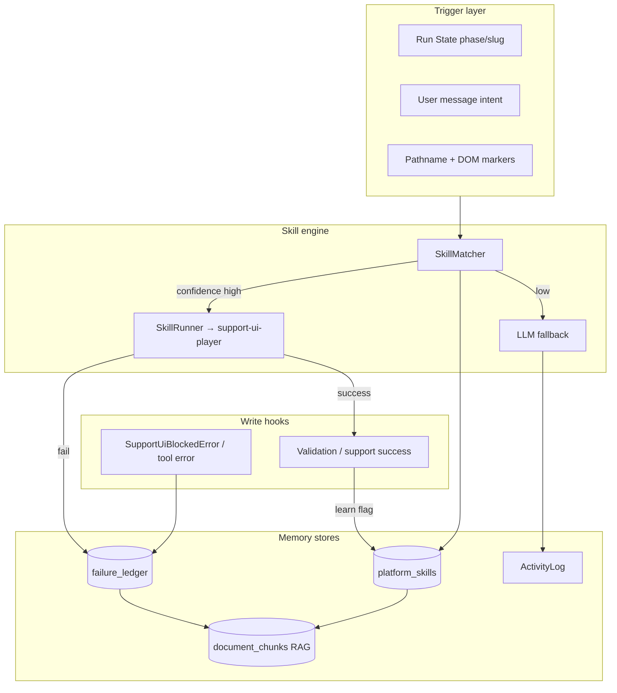

# Phase 2 Implementation Plan — Operation Institutional Memory

**Project:** manage-agent  
**Mission:** Agents get smarter from wins AND mistakes — without a bigger model.  
**Prerequisite:** [Phase 1 — Ground Truth](./01-phase-1-ground-truth.md) (run state, precision routing, graduated autonomy)  
**Status:** Plan only — no code yet  
**Estimated duration:** 3–4 weeks (1 engineer), or 2 weeks with parallel BE/FE tracks

---

## Executive summary

1. **Skill Library** — Store reusable procedures (triggers + `SupportUiScript` steps + optional SKILL.md body) learned from success or authored by admins; run deterministically before calling the LLM.
2. **Failure Ledger** — Record recurring support/wizard/invoke failures with root-cause tags and recommended fixes; inject into context and auto-suggest recovery.
3. **Light improvement loop** — Skill versioning + promote/demote by measured success rate (not full Hermes GEPA in v1).
4. **Agent procedural memory** — Extend the same primitives to tenant agents (optional “save as skill” after validation).
5. **Reuse existing primitives** — `SupportUiScript`, `VectorStore`/`DocumentChunk`, `ActivityLog`, Phase 1 `run_state`; no Hermes embed.

---

## Architecture (target)



---

## Phase 0: Documentation discovery (complete)

### Allowed APIs & patterns (copy from these)

| Pattern | Source | Use for |
|---------|--------|---------|
| `SupportUiScript` / steps | `frontend/src/lib/support-ui-script.ts` | Skill procedure format |
| Script playback | `frontend/src/components/support/support-ui-player.tsx` | SkillRunner execution |
| Bridge scripts | `support-wizard-mission.ts` L189–244 | Migrate hardcoded skills |
| Local continue path | `support-wizard-heal.ts` L25–57 | Pre-LLM skill execution |
| Tool UI scripts | `backend/src/agents_lib/platform_tools.py` `_ui_script()` | Backend-generated procedures |
| Grounding + retry | `graph_agent.py` L230–376 | Skip LLM when skill runs |
| Vector ingest | `vector_store.py` L58–80, `document_chunk.py` | RAG for skill/failure text |
| Knowledge admin UI | `knowledge-base-admin.tsx` | Copy patterns for skill admin |
| Validation failures | `agent_validation_service.py` L85–291 | Failure taxonomy seed |
| Activity details | `activity_service.py` L39–60 | Success/failure hooks |
| Phase 1 run state | `docs/plans/01-phase-1-ground-truth.md` | Skill trigger inputs |

### Anti-patterns (do NOT)

- Store skills only in LLM system prompt prose
- Auto-write production Python without review (`AgentScriptService` allowlist stays)
- Duplicate `KnowledgeDataset` for skills without clear `kind` separation
- Learn skills from failed runs without human review in v1 (queue only)
- Replace Phase 1 run state with skill state — skills **read** run state, don’t own slug truth
- Full-text duplicate of every chat turn in ledger — store **patterns**, not PII-heavy blobs

---

## Dependency on Phase 1

| Phase 1 deliverable | Phase 2 usage |
|---------------------|---------------|
| `run_state.phase` | Primary skill trigger |
| `run_state.payload.autonomy_level` | L0 = no skill auto-run; L2+ = skill first |
| `execution_precision` | P0 agents skip procedural skills that invoke LLM |
| Authoritative slug in run state | Skill payload `{ "agent_slug": "$run_state.slug" }` |

**Gate:** Phase 2 M1 can start in parallel once Phase 1 M1b (run-state API) is merged; full integration requires Phase 1 complete.

---

## Milestone 1: Skill Library core (week 1)

### 1.1 Data model

**New table:** `platform_skills`

```sql
CREATE TABLE platform_skills (
  id UUID PRIMARY KEY DEFAULT gen_random_uuid(),
  slug VARCHAR(120) NOT NULL UNIQUE,
  name VARCHAR(255) NOT NULL,
  name_fa VARCHAR(255) NULL,
  description TEXT NULL,
  scope VARCHAR(32) NOT NULL DEFAULT 'platform',  -- platform | org | agent
  org_id UUID NULL,          -- future: multi-tenant org
  agent_id UUID NULL REFERENCES agents(id) ON DELETE CASCADE,
  source VARCHAR(16) NOT NULL DEFAULT 'manual',  -- manual | learned | imported
  status VARCHAR(16) NOT NULL DEFAULT 'draft', -- draft | active | archived
  version INT NOT NULL DEFAULT 1,
  supersedes_id UUID NULL REFERENCES platform_skills(id),
  trigger JSONB NOT NULL DEFAULT '{}',
  procedure JSONB NOT NULL DEFAULT '{}',  -- SupportUiScript-compatible
  content_md TEXT NULL,                   -- agentskills.io-style body for LLM fallback
  stats JSONB NOT NULL DEFAULT '{"success_count":0,"failure_count":0,"last_used_at":null}',
  created_by UUID NULL REFERENCES users(id),
  created_at TIMESTAMPTZ NOT NULL DEFAULT now(),
  updated_at TIMESTAMPTZ NOT NULL DEFAULT now()
);
CREATE INDEX idx_platform_skills_status ON platform_skills(status);
CREATE INDEX idx_platform_skills_scope ON platform_skills(scope, agent_id);
```

**`trigger` schema (JSON):**

```json
{
  "phase_any": ["training", "dashboard", "validation"],
  "pathname_prefix": "/agents/create",
  "intent_regex": "ادامه|continue",
  "run_state": { "slug_verified": true },
  "min_autonomy_level": 2,
  "agent_kind_any": ["chat", "worker"],
  "priority": 100
}
```

**`procedure` schema:** identical to `SupportUiScript`:

```json
{
  "label": "ادامه تست بدون ساخت مجدد",
  "steps": [
    {
      "type": "bridge",
      "action": "wizard.continue_testing",
      "payload": { "agent_slug": "{{run_state.slug}}" },
      "label": "آموزش، پنل، تست"
    }
  ]
}
```

**Template variables (resolved at runtime, never by LLM):**

| Token | Source |
|-------|--------|
| `{{run_state.slug}}` | Phase 1 run state API |
| `{{run_state.phase}}` | Run state |
| `{{user.id}}` | Auth session |
| `{{payload.name}}` | Stored wizard create payload |

**New file:** `backend/src/core/skill_template.py` — safe substitution; reject unknown keys.

### 1.2 Backend service & API

**Files:**

- `backend/src/models/platform_skill.py`
- `backend/src/schemas/platform_skill.py`
- `backend/src/services/skill_service.py`
- `backend/src/services/skill_matcher.py`
- `backend/src/api/v1/skills.py`

| Method | Path | Auth | Description |
|--------|------|------|-------------|
| GET | `/api/v1/skills` | admin / superuser | List with filters (`scope`, `status`) |
| POST | `/api/v1/skills` | admin | Create manual skill |
| GET | `/api/v1/skills/{slug}` | admin | Detail |
| PUT | `/api/v1/skills/{slug}` | admin | Update (bumps version if procedure changes) |
| POST | `/api/v1/skills/{slug}/activate` | admin | draft → active |
| POST | `/api/v1/skills/match` | authenticated | **Runtime:** given run_state + message → best skill or 404 |
| POST | `/api/v1/skills/{slug}/record-outcome` | internal/FE | success/failure stats |

**`SkillMatcher.match(context) → MatchResult`:**

```python
@dataclass
class MatchResult:
    skill: PlatformSkill | None
    confidence: float  # 0..1
    reasons: list[str]
```

**Scoring (v1, deterministic):**

| Signal | Weight |
|--------|--------|
| `phase` exact match | +0.4 |
| `pathname_prefix` match | +0.2 |
| `intent_regex` match | +0.2 |
| `run_state` predicates | +0.2 |
| Historical `success_rate` | × multiplier 0.8–1.2 |
| Below `min_autonomy_level` | disqualify |

Threshold: **≥ 0.75** → execute skill without LLM; **0.5–0.74** → suggest skill in UI; **< 0.5** → LLM path.

### 1.3 Frontend skill runner

**New files:**

- `frontend/src/lib/skill-client.ts` — API wrapper
- `frontend/src/lib/skill-runner.ts` — `matchAndRunSkill(context): Promise<'ran'|'no_match'|'failed'>`

**Flow in `platform-support-assistant.tsx` (update send path):**

```
1. Fetch run state (Phase 1)
2. POST /skills/match { run_state, message, pathname, snapshot_hash }
3. If confidence ≥ threshold AND autonomy ≥ L2:
     runUiOutcome(skill.procedure)  // existing player
     record-outcome success/failure
     return (skip LLM)
4. Else → existing LLM invoke loop
```

**Copy pattern from:** `resolveLocalWizardContinueScript` (757–776) — generalize to skill runner.

### 1.4 Seed skills (migrate hardcoded bridges)

Import as `status=active`, `source=imported`:

| Slug | Replaces | Trigger |
|------|----------|---------|
| `wizard.continue-testing` | `buildWizardContinueTestingScript` | phase ∈ post-publish, intent continue |
| `wizard.create-full` | `buildWizardCreateBridgeScript` | phase wizard_steps, has name |
| `wizard.permissions-default` | `ensurePermissionsDefault` recovery | blocker permissions regex |
| `wizard.resolve-planning` | planning auto-resolve | marker wizard-planning-questions |

Keep TS builders as **fallback** if skill API unavailable (feature flag).

### 1.5 Verification (Milestone 1)

- [ ] Unit: `SkillMatcher` scoring table-driven tests
- [ ] Unit: template substitution rejects `{{unknown}}`
- [ ] Integration: match returns `wizard.continue-testing` on verified slug + continue intent
- [ ] Manual: support “continue” runs bridge without LLM at L2
- [ ] Admin: create draft skill, activate, appears in match

---

## Milestone 2: Failure Ledger (week 2)

### 2.1 Data model

**New table:** `failure_ledger`

```sql
CREATE TABLE failure_ledger (
  id UUID PRIMARY KEY DEFAULT gen_random_uuid(),
  pattern_hash VARCHAR(64) NOT NULL,
  scope VARCHAR(32) NOT NULL DEFAULT 'platform',
  phase VARCHAR(32) NULL,
  pathname_prefix VARCHAR(255) NULL,
  tool_name VARCHAR(120) NULL,
  error_regex VARCHAR(512) NOT NULL,
  root_cause_tag VARCHAR(64) NOT NULL,
  recommended_fix JSONB NOT NULL DEFAULT '{}',
  occurrence_count INT NOT NULL DEFAULT 1,
  last_seen_at TIMESTAMPTZ NOT NULL DEFAULT now(),
  resolved_by_skill_id UUID NULL REFERENCES platform_skills(id),
  sample_redacted TEXT NULL,
  UNIQUE(pattern_hash)
);
CREATE INDEX idx_failure_ledger_tag ON failure_ledger(root_cause_tag);
CREATE INDEX idx_failure_ledger_count ON failure_ledger(occurrence_count DESC);
```

**`root_cause_tag` enum (v1):**

`slug_hallucination` | `permissions_ui` | `blocker_misdetect` | `wizard_step_rewind` | `agent_not_found` | `planning_stuck` | `widget_disabled` | `network` | `unknown`

**`recommended_fix` examples:**

```json
{ "type": "skill", "skill_slug": "wizard.continue-testing" }
{ "type": "user_action", "message_fa": "دسترسی پیش‌فرض را دستی بزنید" }
{ "type": "tool", "tool": "platform_list_agents" }
```

### 2.2 Write path

**New file:** `backend/src/services/failure_ledger_service.py`

**Hook points:**

| Event | Location | Action |
|-------|----------|--------|
| `SupportUiBlockedError` | `support-ui-player.tsx` catch | POST `/failures/record` |
| Tool `success: false` | After platform tool in FE | record with tool name |
| `humanizeSupportError` patterns | `support-error-text.ts` | map to tag + regex |
| Validation failure | `agent_validation_service.py` | optional aggregate tags |

**Privacy:** strip emails, slugs optional → hash; store `sample_redacted` max 200 chars.

**Dedup:** `pattern_hash = sha256(tag + normalized_error + phase + tool)`.

### 2.3 Read path

**API:**

| Method | Path | Description |
|--------|------|-------------|
| GET | `/api/v1/failures/relevant` | Query by phase, pathname, error substring |
| GET | `/api/v1/failures/top` | Admin dashboard |
| POST | `/api/v1/failures/record` | Internal record |

**Context injection (`page-guide-context.ts`):**

```
[FAILURE HINTS — from ledger]
- slug_hallucination (×47): use run_state.slug only; skill wizard.continue-testing
- permissions_ui (×12): skill wizard.permissions-default
```

**Auto-recovery (`support-auto-recovery.ts`):**

Before LLM retry, GET relevant failures → if `recommended_fix.type === 'skill'` and autonomy ≥ L2 → run skill once.

### 2.4 RAG index (optional v1.1)

On record/update, upsert `DocumentChunk` with:

- `source = "failure_ledger:{pattern_hash}"`
- `meta = { "kind": "failure", "tag": "...", "count": N }`

Use existing `VectorStore.search()` for fuzzy match when regex miss.

### 2.5 Verification (Milestone 2)

- [ ] Record increments `occurrence_count` on duplicate pattern
- [ ] “Agent not found” surfaces ledger hint in support context
- [ ] Auto-recovery runs linked skill once, then stops
- [ ] Admin top failures page shows counts
- [ ] No raw `.env` or emails in `sample_redacted`

---

## Milestone 3: Learning loop & skill lifecycle (week 3)

### 3.1 Learn from success (queued, not auto-active)

**Trigger:** validation `ok: true` OR support run completes with `wizard-testing-complete` marker.

**New file:** `backend/src/services/skill_learning_service.py`

**Pipeline:**

1. Collect trajectory: run state transitions + UI scripts executed + tool calls (from ActivityLog.details)
2. Generate **draft** skill:
   - `procedure` = concatenation of successful `SupportUiScript` steps (dedupe)
   - `trigger` = inferred from final run state + user intent from first message
   - `content_md` = LLM summary (optional, admin-only generation)
3. Save as `status=draft`, `source=learned`
4. Notify admin: “New skill candidate ready for review”

**Feature flag:** `SKILL_LEARNING_V1=false` by default.

### 3.2 Versioning & promotion

When editing procedure:

- Increment `version`
- Set `supersedes_id` chain
- Keep prior version `archived` after new version `activated`

**A/B (simple v1):**

- `platform_skills.stats` tracks success/failure per version
- Nightly job or on-record-outcome: if v2 success_rate > v1 + 10% over ≥20 runs → auto-promote v2, archive v1
- Requires `SKILL_AB_PROMOTION_V1=true`

### 3.3 Skill deprecation

- Cron: archive skills with `last_used_at` > 90 days (warn admin 7 days before)
- Never archive `source=imported` seed skills without manual confirm

### 3.4 Failure → skill link

When admin resolves a ledger entry:

- UI: “Create skill from fix” → prefill procedure from last successful recovery script
- Set `failure_ledger.resolved_by_skill_id`

### 3.5 Verification (Milestone 3)

- [ ] Successful wizard run creates draft skill (flag on)
- [ ] Draft does NOT match until activated
- [ ] Version bump preserves history
- [ ] Promotion job respects minimum sample size

---

## Milestone 4: Agent-level procedural memory (week 3–4)

### 4.1 Scope extension

Same tables, `scope='agent'` + `agent_id` set.

**Use cases:**

- After worker validation success: “Save processing recipe as skill”
- Chat agent: episodic summary stored as `content_md` skill with trigger on keyword set

### 4.2 Wizard UX

**File:** `wizard-post-publish-panel.tsx`

Button (when validation ok): **«ذخیره روال موفق به‌عنوان مهارت»**

Creates agent-scoped draft skill from executed bridges.

### 4.3 Invoke-time retrieval (tenant agents)

**File:** `orchestrator_service.py` — before ReAct:

```python
skill = await skill_matcher.match_agent_context(agent, payload, enriched_input)
if skill and precision != DETERMINISTIC:
    # Optional: run skill as pre-step or inject content_md into system prompt
```

Start with **prompt injection only** for agent skills (no UI bridges for tenant chat agents).

### 4.4 Verification (Milestone 4)

- [ ] Agent-scoped skill not visible in platform match
- [ ] Save recipe creates draft linked to agent_id
- [ ] RAG search includes agent skills when `agent_id` set

---

## Milestone 5: Admin UI, flags, polish (week 4)

### 5.1 Admin pages

**New:** `frontend/src/app/(dashboard)/admin/skills/page.tsx`

- List skills (status, success rate, last used)
- Edit trigger JSON + procedure (Monaco or structured form)
- Preview procedure in read-only player
- Link to related failure ledger entries

**New:** `frontend/src/app/(dashboard)/admin/failures/page.tsx`

- Top patterns, tag filter, link “create skill”

Copy layout patterns from `knowledge-base-admin.tsx`.

### 5.2 Feature flags

```
SKILL_LIBRARY_V1=true
FAILURE_LEDGER_V1=true
SKILL_LEARNING_V1=false
SKILL_AB_PROMOTION_V1=false
```

### 5.3 Observability

Extend `execution_trace` with steps:

- `skill_match` — confidence, slug
- `skill_run` — success/fail
- `failure_hint` — tags injected

### 5.4 Repo sync (dev/prod parity)

**Directory:** `backend/skills/platform/*.json` + optional `SKILL.md`

- On deploy: `scripts/sync_platform_skills.py` upserts into DB
- Cursor skills in `.cursor/skills/` remain dev-only; exported JSON is runtime source

### 5.5 Final verification

- [ ] Full support wizard path uses ≥1 seed skill, zero slug hallucination regressions
- [ ] Failure ledger populated in staging after fault injection tests
- [ ] Admin can deactivate skill → system falls back to LLM
- [ ] `pytest backend/tests/unit/test_skill_*.py`
- [ ] `vitest frontend/src/lib/skill-*.test.ts`
- [ ] graphify update

---

## File change summary

### New backend files

| Path | Purpose |
|------|---------|
| `alembic/versions/*_platform_skills.py` | Migration |
| `alembic/versions/*_failure_ledger.py` | Migration |
| `models/platform_skill.py` | ORM |
| `models/failure_ledger.py` | ORM |
| `schemas/platform_skill.py` | Pydantic |
| `schemas/failure_ledger.py` | Pydantic |
| `services/skill_service.py` | CRUD |
| `services/skill_matcher.py` | Runtime match |
| `services/skill_learning_service.py` | Draft generation |
| `services/failure_ledger_service.py` | Record/query |
| `core/skill_template.py` | `{{var}}` resolution |
| `api/v1/skills.py` | REST |
| `api/v1/failures.py` | REST |
| `skills/platform/*.json` | Seed procedures |
| `scripts/sync_platform_skills.py` | Deploy sync |
| `tests/unit/test_skill_matcher.py` | Tests |
| `tests/unit/test_failure_ledger.py` | Tests |

### New frontend files

| Path | Purpose |
|------|---------|
| `lib/skill-client.ts` | API |
| `lib/skill-runner.ts` | Match + play |
| `lib/skill-runner.test.ts` | Tests |
| `app/(dashboard)/admin/skills/page.tsx` | Admin |
| `app/(dashboard)/admin/failures/page.tsx` | Admin |

### Modified files (primary)

| Path | Change |
|------|--------|
| `platform-support-assistant.tsx` | Skill-before-LLM path |
| `support-auto-recovery.ts` | Ledger-aware recovery |
| `page-guide-context.ts` | Failure hints block |
| `support-wizard-heal.ts` | Delegate to skill runner |
| `support-ui-player.tsx` | Record failures on block |
| `graph_agent.py` | Skip retry if skill ran |
| `agent_validation_service.py` | Success → learning hook |
| `sidebar.tsx` | Admin nav links |

---

## Migration from hardcoded bridges

| Step | Action |
|------|--------|
| 1 | Ship skill tables + seed JSON mirroring current TS scripts |
| 2 | Feature flag: skill runner tries match before `resolveLocalWizardContinueScript` |
| 3 | Parity tests: skill procedure ≡ TS builder output |
| 4 | Remove TS builders from hot path; keep as offline fallback generator |
| 5 | Generate seed JSON from TS in CI to prevent drift |

---

## Risks & mitigations

| Risk | Mitigation |
|------|------------|
| Bad learned skill breaks wizard | draft-only + admin activate; flag off by default |
| Skill trigger too broad | priority + confidence threshold; test matrix |
| Ledger PII leakage | redaction + hash patterns |
| Procedure drift vs DOM | version skills; link to `data-ma-support` selectors; visual regression later |
| Duplicate with KnowledgeDataset | separate table; chunks tagged `kind=skill` in meta |
| Phase 1 delay blocks triggers | stub run state reader with session fallback |

---

## Explicit non-goals (Phase 2)

- Hermes closed learning loop / Honcho / Mem0
- GEPA genetic prompt evolution
- Public skill marketplace
- Auto-active learned skills without admin review
- Replacing `AgentScriptService` pinned Python
- Phase 3 sandbox execution backend

---

## Execution order (10 sessions)

1. **M1a** — Migrations + models + SkillService CRUD  
2. **M1b** — SkillMatcher + template resolver + tests  
3. **M1c** — `/skills` API + seed JSON + sync script  
4. **M1d** — `skill-runner.ts` + wire support assistant  
5. **M2a** — Failure ledger model + record API  
6. **M2b** — Failure read path + context injection + auto-recovery  
7. **M2c** — Admin failures page  
8. **M3a** — Skill learning service (draft queue)  
9. **M3b** — Versioning + admin skills page  
10. **M4** — Agent-scoped skills + flags + QA checklist  

---

## Creative stretch (post-v1)

- **Skill Forge:** replay last support session → draft skill (admin UI)
- **Persian skill names** in UI with English slug ids
- **Skill dependency graph:** `requires_skill: wizard.create-full` before continue
- **Export to Cursor SKILL.md** for dev/prod parity
- **Confidence UI:** show user “Running saved procedure: ادامه تست…” badge

---

## Complete Test & Verification Matrix

Every deliverable below must pass before Phase 2 is considered done. Phase 1 run-state tests must remain green throughout.

**Commands (baseline):**

```bash
cd backend && pytest tests/unit/test_skill_matcher.py tests/unit/test_skill_template.py tests/unit/test_failure_ledger.py tests/integration/test_skills_api.py -q
cd frontend && npm run test -- skill-runner skill-client support-auto-recovery
# Full phase gate:
cd backend && pytest tests/unit/test_skill*.py tests/unit/test_failure_ledger*.py tests/integration/test_skills*.py tests/integration/test_failures*.py -q
cd frontend && npm run test -- skill support-auto-recovery page-guide-context
python backend/scripts/sync_platform_skills.py --dry-run  # seed parity
```

---

### Milestone 1 — Skill Library core

#### 1.1 Data model (`platform_skills`)

| # | Test | Type | How to verify | Pass criteria |
|---|------|------|---------------|---------------|
| 1.1.1 | Migration applies | Integration | `alembic upgrade head` | Table + indexes exist |
| 1.1.2 | Unique slug | Unit | Duplicate slug insert | Integrity error |
| 1.1.3 | Procedure JSON schema | Unit | Invalid step type | Pydantic validation error |
| 1.1.4 | Trigger JSON schema | Unit | Missing required shape | Validation error |
| 1.1.5 | scope=agent requires agent_id | Unit | agent scope, null agent_id | Rejected |
| 1.1.6 | stats default | Unit | New row | `{success_count:0,...}` |
| 1.1.7 | supersedes_id chain | Unit | v2 supersedes v1 | FK valid; v1 archivable |

**Test file:** `backend/tests/unit/test_skill_service.py`

#### 1.2 Backend service & API

| # | Test | Type | How to verify | Pass criteria |
|---|------|------|---------------|---------------|
| 1.2.1 | CRUD admin only | Integration | Non-admin POST /skills | 403 |
| 1.2.2 | List filter status | Integration | GET ?status=active | Only active returned |
| 1.2.3 | Activate draft | Integration | POST activate | status=active |
| 1.2.4 | Match endpoint auth | Integration | Authenticated POST /skills/match | 200 with MatchResult |
| 1.2.5 | Match no skill | Integration | Wrong phase | confidence=0 or 404 |
| 1.2.6 | record-outcome increments | Integration | POST success twice | success_count=2 |
| 1.2.7 | Version bump on procedure edit | Unit | PUT procedure change | version+=1 |
| 1.2.8 | Draft excluded from match | Integration | status=draft | Never returned |

**Test files:** `backend/tests/integration/test_skills_api.py`, `backend/tests/unit/test_skill_matcher.py`

#### 1.2 SkillMatcher scoring

| # | Test | Type | How to verify | Pass criteria |
|---|------|------|---------------|---------------|
| 1.2.9 | Phase match +0.4 | Unit | Table-driven | Score component correct |
| 1.2.10 | intent_regex match | Unit | "ادامه" vs "hello" | Persian match wins |
| 1.2.11 | min_autonomy disqualify | Unit | L1 + min_autonomy=2 | skill=null |
| 1.2.12 | success_rate multiplier | Unit | 90% vs 10% history | Higher rate ranks first |
| 1.2.13 | Threshold ≥0.75 execute | Unit | Score 0.76 | `should_execute=true` |
| 1.2.14 | Threshold 0.5–0.74 suggest | Unit | Score 0.6 | suggest only, no auto-run |
| 1.2.15 | Priority tie-break | Unit | Two skills same score | Higher priority wins |

**Test file:** `backend/tests/unit/test_skill_matcher.py` (parametrized)

#### 1.2 Template resolver (`skill_template.py`)

| # | Test | Type | How to verify | Pass criteria |
|---|------|------|---------------|---------------|
| 1.2.16 | `{{run_state.slug}}` resolves | Unit | Mock run state | Substituted in procedure |
| 1.2.17 | Unknown token rejected | Unit | `{{evil}}` | Raises / validation error |
| 1.2.18 | No LLM in substitution | Static | Code review | Pure string replace only |
| 1.2.19 | Empty slug when unverified | Unit | slug null | Step payload omits or aborts match |

**Test file:** `backend/tests/unit/test_skill_template.py`

#### 1.3 Frontend skill runner

| # | Test | Type | How to verify | Pass criteria |
|---|------|------|---------------|---------------|
| 1.3.1 | matchAndRunSkill happy path | Unit | Mock match + player | Returns `'ran'` |
| 1.3.2 | No match → LLM path | Unit | confidence low | Returns `'no_match'` |
| 1.3.3 | Player failure → record failure | Unit | Mock blocked error | Returns `'failed'`; record-outcome called |
| 1.3.4 | L0 skips auto-run | Unit | autonomy L0 | No player invoke |
| 1.3.5 | Support assistant integration | Integration | Send "ادامه" L2 testing | Skill runs before fetch invoke |
| 1.3.6 | Feature flag off | Integration | SKILL_LIBRARY_V1=false | Falls back to TS heal path |

**Test files:** `frontend/src/lib/skill-runner.test.ts`, `frontend/src/lib/skill-client.test.ts`

#### 1.4 Seed skills (migration from bridges)

| # | Test | Type | How to verify | Pass criteria |
|---|------|------|---------------|---------------|
| 1.4.1 | sync script dry-run | Integration | `sync_platform_skills.py --dry-run` | 4 seeds listed |
| 1.4.2 | Parity continue-testing | Unit | JSON procedure vs `buildWizardContinueTestingScript` | Steps equivalent |
| 1.4.3 | Parity create-full | Unit | vs `buildWizardCreateBridgeScript` | Steps equivalent |
| 1.4.4 | Parity permissions | Unit | vs recovery script | Steps equivalent |
| 1.4.5 | Active seeds matchable | Integration | POST match in each trigger context | Correct slug returned |
| 1.4.6 | CI drift check | CI | Generate JSON from TS vs committed | No diff |

**Test file:** `backend/tests/integration/test_skill_seed_parity.py`

---

### Milestone 2 — Failure Ledger

#### 2.1 Data model

| # | Test | Type | How to verify | Pass criteria |
|---|------|------|---------------|---------------|
| 2.1.1 | Migration applies | Integration | alembic | Table exists |
| 2.1.2 | pattern_hash unique | Unit | Duplicate hash | Upsert increments count |
| 2.1.3 | root_cause_tag enum | Unit | Invalid tag | Validation error |
| 2.1.4 | recommended_fix schema | Unit | Invalid type | Validation error |

**Test file:** `backend/tests/unit/test_failure_ledger.py`

#### 2.2 Write path

| # | Test | Type | How to verify | Pass criteria |
|---|------|------|---------------|---------------|
| 2.2.1 | SupportUiBlockedError records | Unit | Player catch mock | POST /failures/record called |
| 2.2.2 | Tool success:false records | Unit | Platform tool mock | tool_name stored |
| 2.2.3 | Dedup increments count | Integration | Same error twice | occurrence_count=2 |
| 2.2.4 | Email redaction | Unit | Error with email | Not in sample_redacted |
| 2.2.5 | sample_redacted max 200 | Unit | Long error | Truncated |
| 2.2.6 | humanizeSupportError mapping | Unit | Known patterns | Correct root_cause_tag |
| 2.2.7 | Validation failure hook | Integration | validation fail | Optional ledger row |

**Test files:** `backend/tests/unit/test_failure_ledger.py`, `frontend/src/lib/support-ui-player.test.ts` (mock)

#### 2.3 Read path

| # | Test | Type | How to verify | Pass criteria |
|---|------|------|---------------|---------------|
| 2.3.1 | GET /failures/relevant | Integration | phase+error query | Ordered by count |
| 2.3.2 | Context injection | Unit | page-guide-context | `[FAILURE HINTS` block present |
| 2.3.3 | Top-3 limit | Unit | 10 matches | Only 3 in context |
| 2.3.4 | Auto-recovery once | Unit | support-auto-recovery | Skill runs once; second attempt skips |
| 2.3.5 | L1 no auto-recovery | Unit | autonomy L1 | Hint only, no skill run |
| 2.3.6 | Admin top failures | Manual | /admin/failures | Counts match DB |

#### 2.4 RAG index (optional v1.1)

| # | Test | Type | How to verify | Pass criteria |
|---|------|------|---------------|---------------|
| 2.4.1 | Chunk upsert on record | Integration | Record failure | DocumentChunk with kind=failure |
| 2.4.2 | Fuzzy search fallback | Integration | Typo in error | VectorStore returns pattern |

---

### Milestone 3 — Learning loop & skill lifecycle

#### 3.1 Learn from success

| # | Test | Type | How to verify | Pass criteria |
|---|------|------|---------------|---------------|
| 3.1.1 | Flag off → no draft | Integration | SKILL_LEARNING_V1=false | No row created |
| 3.1.2 | Flag on + validation ok | Integration | Complete validation | draft skill created |
| 3.1.3 | Draft not matchable | Integration | POST match | draft excluded |
| 3.1.4 | Procedure dedupe | Unit | Duplicate steps in trajectory | Single step in procedure |
| 3.1.5 | Admin notification | Manual | Draft created | Notification visible |

**Test file:** `backend/tests/unit/test_skill_learning_service.py`

#### 3.2 Versioning & promotion

| # | Test | Type | How to verify | Pass criteria |
|---|------|------|---------------|---------------|
| 3.2.1 | Edit bumps version | Integration | PUT procedure | version=2, supersedes set |
| 3.2.2 | Activate archives old | Integration | Activate v2 | v1 status=archived |
| 3.2.3 | A/B flag off | Integration | SKILL_AB_PROMOTION_V1=false | No auto-promote |
| 3.2.4 | A/B promotes v2 | Unit | v2 +10% over 20 runs | v2 active, v1 archived |
| 3.2.5 | Min sample size | Unit | 5 runs only | No promotion |

#### 3.3 Skill deprecation

| # | Test | Type | How to verify | Pass criteria |
|---|------|------|---------------|---------------|
| 3.3.1 | 90d unused → archive | Unit | Mock last_used_at | status=archived |
| 3.3.2 | Imported seed protected | Unit | source=imported | Cron skips |
| 3.3.3 | 7d warning | Manual | Admin email/list | Warning before archive |

#### 3.4 Failure → skill link

| # | Test | Type | How to verify | Pass criteria |
|---|------|------|---------------|---------------|
| 3.4.1 | Create skill from fix UI | Manual | Admin failures page | Draft prefilled |
| 3.4.2 | resolved_by_skill_id set | Integration | Link skill | FK populated |

---

### Milestone 4 — Agent-level procedural memory

| # | Test | Type | How to verify | Pass criteria |
|---|------|------|---------------|---------------|
| 4.1 | Agent scope isolation | Integration | Platform match | agent skill not returned |
| 4.2 | Agent match with agent_id | Integration | match_agent_context | Returns agent skill |
| 4.3 | Save recipe button | Manual | Post-validation wizard | Draft created with agent_id |
| 4.4 | RAG includes agent skills | Integration | VectorStore search | Chunks with agent_id |
| 4.5 | P0 deterministic skips injection | Unit | precision P0 | No skill prompt inject |
| 4.6 | Prompt injection only (chat) | Integration | Chat agent skill | content_md in system prompt; no UI bridge |

**Test file:** `backend/tests/integration/test_agent_scoped_skills.py`

---

### Milestone 5 — Admin UI, flags, polish

#### 5.1 Admin pages

| # | Test | Type | How to verify | Pass criteria |
|---|------|------|---------------|---------------|
| 5.1.1 | Skills list loads | Manual | /admin/skills | Status, rates shown |
| 5.1.2 | Edit trigger + procedure | Manual | Save changes | Match behavior updates |
| 5.1.3 | Preview player read-only | Manual | Preview button | Steps render, no execute |
| 5.1.4 | Failures → create skill link | Manual | Click link | Navigates with prefill |
| 5.1.5 | Non-admin blocked | Integration | GET /admin/skills | 403 or redirect |

#### 5.2 Feature flags

| # | Test | Type | How to verify | Pass criteria |
|---|------|------|---------------|---------------|
| 5.2.1 | SKILL_LIBRARY_V1 off | E2E | Support continue | TS fallback works |
| 5.2.2 | FAILURE_LEDGER_V1 off | E2E | Induce error | No record API calls |
| 5.2.3 | All on staging | E2E | Full wizard | Skills + ledger active |

#### 5.3 Observability

| # | Test | Type | How to verify | Pass criteria |
|---|------|------|---------------|---------------|
| 5.3.1 | skill_match trace step | Integration | Skill run invoke | trace contains confidence |
| 5.3.2 | skill_run trace step | Integration | After player | success/fail in trace |
| 5.3.3 | failure_hint trace step | Integration | Ledger hit | tags in trace |

#### 5.4 Repo sync

| # | Test | Type | How to verify | Pass criteria |
|---|------|------|---------------|---------------|
| 5.4.1 | Deploy sync upserts | Integration | sync script run | DB matches JSON files |
| 5.4.2 | Idempotent sync | Integration | Run twice | No duplicate slugs |

---

### Bridge migration verification (cross-cutting)

| # | Test | Type | How to verify | Pass criteria |
|---|------|------|---------------|---------------|
| MIG-1 | Hot path uses skill runner | Integration | SKILL_LIBRARY_V1=true | match before heal |
| MIG-2 | Fallback when API down | Integration | Skills 503 | TS builders still work |
| MIG-3 | Zero slug hallucination | E2E | Continue testing L2 | Uses run_state slug only |
| MIG-4 | Deactivated skill | Manual | Deactivate continue-testing | LLM fallback, no crash |
| MIG-5 | karkard regression | Integration | Worker karkard invoke | Unchanged; no skill intercept |

---

### Per-session exit criteria

| Session | Must pass before merge |
|---------|------------------------|
| M1a | 1.1.* + skill service CRUD |
| M1b | 1.2.9–1.2.19 matcher + template |
| M1c | 1.2.1–1.2.8 API + 1.4.1–1.4.3 seed parity |
| M1d | 1.3.* + 1.4.5 + E2E continue without LLM |
| M2a | 2.1.* + 2.2.1–2.2.6 |
| M2b | 2.3.* + 2.2.7 |
| M2c | 2.3.6 admin page manual |
| M3a | 3.1.* + 3.2.1–3.2.2 |
| M3b | 3.2.* + 3.3.* + 5.1 admin skills |
| M4 | 4.* + MIG-* + full manual QA |

---

### Phase 2 release gate — end-to-end scenarios

| # | Scenario | Pass criteria |
|---|----------|---------------|
| E2E-1 | "ادامه" at L2 testing phase | Skill runs; no LLM slug guess; bridge completes |
| E2E-2 | Permissions error ×2 | Ledger count=2; hint in context; auto-recovery once |
| E2E-3 | Deactivate all seed skills | Support still works via LLM + TS fallback |
| E2E-4 | Admin creates + activates custom skill | Matches on trigger; runs procedure |
| E2E-5 | Learned draft (flag on) | Not active until admin promotes |
| E2E-6 | Agent-scoped skill | Not visible in platform support match |
| E2E-7 | Save recipe after validation | Draft linked to agent_id |
| E2E-8 | karkard worker | No skill intercept; Phase 1 precision intact |

---

### Manual QA checklist (copy before release)

```
[ ] Seed skill wizard.continue-testing runs at L2 without LLM
[ ] Deactivated skill falls back to LLM gracefully
[ ] Induced permissions error → ledger count +1 → hint in context
[ ] Linked skill auto-runs once on repeat error
[ ] Learned draft (flag on) NOT active until admin promotes
[ ] Agent-scoped skill saved from successful validation
[ ] Template {{run_state.slug}} resolves correctly
[ ] No regression: karkard worker path unchanged
[ ] Admin skills list shows success/failure rates
[ ] sync_platform_skills.py --dry-run matches committed JSON
[ ] pytest tests/unit/test_skill*.py tests/unit/test_failure_ledger*.py — all green
[ ] vitest skill-runner skill-client — all green
[ ] graphify update . after merge
```

---

## Annex B — قرارداد گزارش مهارت و «فقط آنچه تأیید شد»

> الهام از الگوی «مهارت قبل از LLM» و گزارش صادقانه پس از کار — **بازنویسی برای manage-agent**.

### B.1 ترتیب اجرا (معادل read_skill)

```
1. GET run_state
2. POST /skills/match
3. اگر confidence ≥ 0.75 و autonomy ≥ L2:
     a. resolve templates ({{run_state.slug}} …)
     b. runUiOutcome(procedure)  — بدون فراخوانی LLM
     c. POST record-outcome
     d. پاسخ کاربر طبق B.3
4. وگرنه → LLM (با failure hints اگر هست)
```

**قانون:** procedure از DB اجرا شود؛ `content_md` فقط fallback وقتی procedure شکست خورد و autonomy اجازه دهد.

### B.2 قرارداد پاسخ پس از مهارت موفق

قالب ثابت (فارسی):

```
✓ روال ذخیره‌شده اجرا شد: {name_fa}
  گام بعد: {یک خط از inspectWizardCreatePage یا run_state.phase}
```

- **نه** تکرار درخواست کاربر.
- **نه** لیست ۱۰ مرحلهٔ داخلی.
- **نه** ادعای «همه‌چیز درست است» مگر read-back (B.4) pass شده.

اگر confidence 0.5–0.74: پیشنهاد در متن — «می‌توانم روال «…» را اجرا کنم — تأیید می‌کنید؟»

### B.3 گزارش صادقانه (verify-before-report)

قبل از `record-outcome: success`:

| چک | روش |
|----|-----|
| فاز درست | `run_state.phase` مطابق انتظار procedure |
| شناسه | اگر procedure به slug نیاز دارد → `agent_slug_verified=true` |
| blocker | `assertNoUiBlocker` pass |
| ابزار آخر | `last_tool` در run state با procedure هم‌خوان |

اگر هر کدام fail → `failure` نه `success`؛ یک ورودی ledger.

**جملهٔ ممنوع در چت:** «همه‌چیز کامل شد» بدون این چک‌ها.

### B.4 read-back زنجیرهٔ مهارت

بعد از آخرین step در `SupportUiScript`:

1. `readWizardStepIndex()` یا marker فاز
2. `GET run_state`
3. اگر procedure ادعای «testing» دارد ولی DOM/phase هنوز `wizard_steps` → **failure** + tag `wizard_step_rewind`

### B.5 مهارت معنادار vs مکانیکی

| مهارت seed | نوع | حداقل autonomy |
|------------|-----|----------------|
| `wizard.permissions-default` | مکانیکی | L2 |
| `wizard.continue-testing` | معنادار (ادامه جریان) | L2 |
| `wizard.create-full` | معنادار (ایجاد) | L2 + فاز مناسب |
| learned draft | همیشه | فقط پس از activate توسط admin |

### B.6 تست‌های الحاق B

| # | Test | Pass criteria |
|---|------|---------------|
| B.6.1 | match + run موفق | پاسخ مطابق قالب B.2؛ بدون invoke LLM |
| B.6.2 | read-back fail | record-outcome=failure؛ ledger +1 |
| B.6.3 | confidence 0.6 | پیشنهاد؛ بدون auto-run |
| B.6.4 | deactivated skill | fallback TS؛ پیام بدون ادعای مهارت |
| B.6.5 | procedure با {{run_state.slug}} خالی | match رد یا abort قبل از player |

---

*Plan assumes Phase 1 run state is the coordination layer. Without Phase 1, use session/URL fallbacks but accept higher hallucination risk until migrated.*
