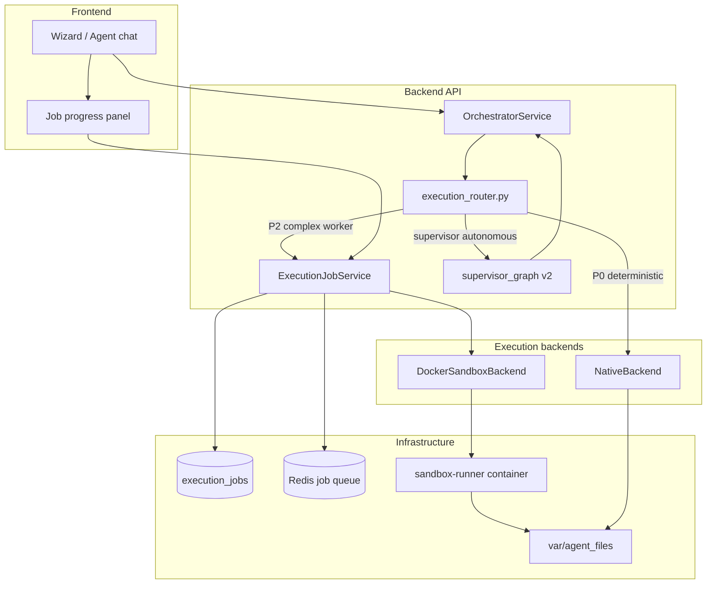
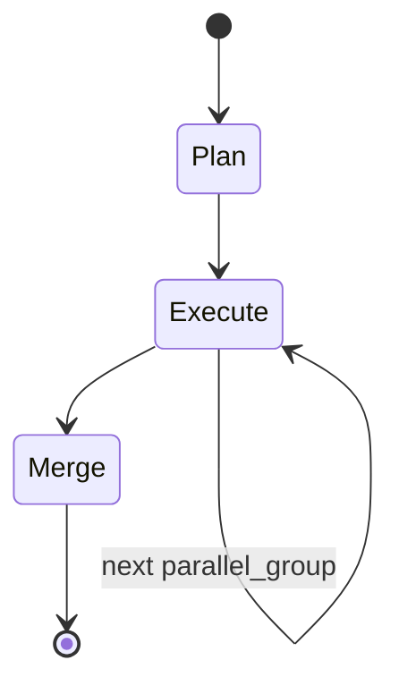

# Phase 3 Implementation Plan — Operation Heavy Lifting

**Project:** manage-agent  
**Mission:** Complex file jobs and multi-agent work without sacrificing tenancy, audit, or deterministic payroll paths.  
**Prerequisites:** [Phase 1 — Ground Truth](./01-phase-1-ground-truth.md), [Phase 2 — Institutional Memory](./02-phase-2-institutional-memory.md)  
**Status:** Plan only — no code yet  
**Estimated duration:** 4–6 weeks (1 engineer), or 3 weeks with parallel infra + app tracks

---

## Executive summary

1. **Execution Backend Abstraction** — `native | sandbox` per worker agent; orchestrator submits async jobs instead of blocking on `runpy` or long ReAct loops.
2. **Docker Sandbox (MVP)** — Isolated container with mounted `var/agent_files/{agent_id}/`, deny-by-default network, tool allowlist, artifact export back to `AgentFile`.
3. **Complex File Pipeline UX** — Job progress UI (queued → running → validating → done); wizard option for sandbox mode with cost/latency warning.
4. **Parallel Supervisor** — Upgrade `supervisor_graph.py` from one-shot router to plan → parallel execute → structured merge with citations.
5. **Observability & cost controls** — Per-org quotas, kill switch, execution trace includes backend type; optional promotion of repeated sandbox success → pinned script (Phase 2 skill).
6. **In-house only** — Two backends (`native`, `docker`); no external agent harness, no third-party sandbox framework embed.

---

## Architecture (target)



---

## Phase 0: Documentation discovery (complete)

### Current execution paths (baseline)

| Path | Entry | Engine | Precision |
|------|-------|--------|-----------|
| Pinned script | `_try_worker_auto_tool` → `run_agent_script` | `runpy` in-process, import allowlist | P0 |
| Karkard HR | ReAct → `karkard_process` tool | `karkard/processor.py` deterministic | P0 |
| Worker ReAct | `graph_agent.run_react_agent` | LangGraph + tools | P1/P2 |
| Supervisor | `supervisor_graph.run_supervisor` | One-shot LLM router → single callee → synth | P2 |
| Chat | `OrchestratorService.invoke_with_agent` | ReAct stream | P2 |

**Key files:**

| Pattern | Source | Use for |
|---------|--------|---------|
| Worker auto-tool bypass | `orchestrator_service.py` L529–670 | NativeBackend fast path |
| Script execution | `agent_script_service.py` L30–47 allowlist, `runpy` | Never run unreviewed code in sandbox without audit |
| Karkard tool | `custom_tools.py` L245+ | Stays NativeBackend only |
| Workspace mount | `agent_workspace_files.py` L35–50 | Sandbox volume bind |
| Supervisor router | `supervisor_graph.py` L29–113 | Replace with plan/execute/merge |
| Agent links | `agent_link.py` L19–22 `SUPERVISES` | Parallel callee groups |
| Execution trace | `execution_trace.py` | Add `sandbox_job`, `supervisor_plan` steps |
| Background work | `agents.py` `BackgroundTasks` | Pattern only — jobs need durable queue |
| Docker stack | `docker-compose.yml` | Add `sandbox-runner` service |
| Phase 1 precision | `01-phase-1-ground-truth.md` | P0 never uses sandbox |
| Phase 2 skills | `02-phase-2-institutional-memory.md` | Sandbox job can reference `skill_id` |

### Anti-patterns (do NOT)

- Route karkard or pinned `run_agent_script` through sandbox (P0 stays in-process)
- Give tenant sandboxes `platform_*` tools or DB credentials
- Replace LangGraph for chat agents
- Embed any external agent harness (Hermes, AutoGPT-style stacks, etc.) — too heavy; extend in-house runner instead
- Use sandbox for platform support UI automation (DOM stays frontend)
- Block invoke HTTP until sandbox completes (always async job + poll/SSE)
- Store secrets in sandbox image layers

---

## Dependencies on Phases 1 & 2

| Prior deliverable | Phase 3 usage |
|-------------------|---------------|
| `execution_precision` | Sandbox only when `autonomous` + explicit `execution_backend=sandbox` |
| `run_state` | Supervisor sub-jobs cache handoff artifacts for idempotent retry |
| `execution_router.py` | Branch to `ExecutionJobService` before ReAct |
| Platform skills | Optional `skill_id` on job; sandbox runner loads procedure |
| Failure ledger | Sandbox OOM/timeout → `root_cause_tag: sandbox_*` |
| Graduated autonomy | L3 not required for sandbox; separate admin gate |

**Gate:** Phase 3 M1 can start once Phase 1 M2b (orchestrator refactor + precision) is merged. Full supervisor v2 benefits from Phase 1 run state; sandbox skill injection needs Phase 2 M1.

---

## Milestone 1: Execution backend abstraction (week 1)

### 1.1 Data model

**New table:** `execution_jobs`

```sql
CREATE TABLE execution_jobs (
  id UUID PRIMARY KEY DEFAULT gen_random_uuid(),
  org_id UUID NULL,  -- future multi-tenant; nullable v1
  user_id UUID NOT NULL REFERENCES users(id),
  agent_id UUID NOT NULL REFERENCES agents(id) ON DELETE CASCADE,
  thread_id VARCHAR(512) NULL,
  parent_job_id UUID NULL REFERENCES execution_jobs(id),
  backend VARCHAR(32) NOT NULL DEFAULT 'native',  -- native | docker
  status VARCHAR(32) NOT NULL DEFAULT 'queued',
  -- queued | running | extracting | validating | succeeded | failed | cancelled | timed_out
  precision VARCHAR(32) NOT NULL,
  input JSONB NOT NULL DEFAULT '{}',
  output JSONB NOT NULL DEFAULT '{}',
  error TEXT NULL,
  skill_id UUID NULL,  -- platform_skills.id when Phase 2 shipped
  started_at TIMESTAMPTZ NULL,
  finished_at TIMESTAMPTZ NULL,
  timeout_seconds INT NOT NULL DEFAULT 900,
  memory_limit_mb INT NOT NULL DEFAULT 2048,
  stats JSONB NOT NULL DEFAULT '{}',  -- cpu_ms, wall_ms, artifact_count, token_estimate
  created_at TIMESTAMPTZ NOT NULL DEFAULT now(),
  updated_at TIMESTAMPTZ NOT NULL DEFAULT now()
);
CREATE INDEX idx_execution_jobs_agent ON execution_jobs(agent_id, created_at DESC);
CREATE INDEX idx_execution_jobs_status ON execution_jobs(status) WHERE status IN ('queued','running');
CREATE INDEX idx_execution_jobs_user ON execution_jobs(user_id);
```

**New table:** `execution_job_artifacts`

```sql
CREATE TABLE execution_job_artifacts (
  id UUID PRIMARY KEY DEFAULT gen_random_uuid(),
  job_id UUID NOT NULL REFERENCES execution_jobs(id) ON DELETE CASCADE,
  agent_file_id UUID NULL REFERENCES agent_files(id),
  relative_path VARCHAR(512) NOT NULL,
  mime_type VARCHAR(128) NULL,
  size_bytes BIGINT NULL,
  description TEXT NULL,
  created_at TIMESTAMPTZ NOT NULL DEFAULT now()
);
CREATE INDEX idx_job_artifacts_job ON execution_job_artifacts(job_id);
```

**Agent schema extension** (`config_json.runtime`):

```json
{
  "execution_backend": "native",
  "sandbox_policy": {
    "network": "deny",
    "max_concurrent": 1,
    "allowed_tools": ["execute_python", "read_file", "write_file", "list_dir"]
  }
}
```

Wizard field: `execution_backend` selector (worker only, admin-gated for `sandbox`).

### 1.2 Backend protocol

**New files:**

- `backend/src/execution/backends/base.py` — `ExecutionBackend` protocol
- `backend/src/execution/backends/native_backend.py` — wraps current orchestrator paths
- `backend/src/execution/backends/docker_backend.py` — MVP sandbox
- `backend/src/services/execution_job_service.py`
- `backend/src/schemas/execution_job.py`
- `backend/src/api/v1/execution_jobs.py`

```python
@dataclass
class ExecutionJobSpec:
    tenant_id: UUID | None
    user_id: UUID
    agent_id: UUID
    thread_id: str | None
    workspace_root: Path
    precision: str
    prompt: str
    input_files: list[Path]
    allowed_tools: list[str]
    timeout_seconds: int
    memory_limit_mb: int
    skill_id: UUID | None = None
    parent_job_id: UUID | None = None
    env_secrets: dict[str, str]  # injected at runtime, never logged

class ExecutionBackend(Protocol):
    async def submit(self, job_id: UUID, spec: ExecutionJobSpec) -> None: ...
    async def poll(self, job_id: UUID) -> JobStatus: ...
    async def cancel(self, job_id: UUID) -> None: ...
    async def collect_artifacts(self, job_id: UUID) -> list[ArtifactRef]: ...
```

**NativeBackend:** synchronous wrapper around existing `_try_worker_auto_tool` + ReAct — used when `execution_backend=native` or precision is P0/P1 without sandbox flag.

**DockerSandboxBackend:** enqueue to Redis; worker process spawns container.

### 1.3 Job queue choice

**Decision: Redis + dedicated asyncio worker** (not Celery in v1).

| Option | Pros | Cons | Verdict |
|--------|------|------|---------|
| FastAPI `BackgroundTasks` | Already used | Not durable, no retry | Reject for sandbox |
| Celery | Mature | New broker config, heavy | v2 if scale demands |
| Redis list + `sandbox-worker` service | Reuse existing Redis; simple | Single-consumer v1 | **MVP** |
| Inline asyncio | Zero infra | Blocks API process | Reject |

**Queue keys:** `ma:sandbox:queue`, `ma:sandbox:dead_letter`

**Worker:** new `backend/scripts/sandbox_worker.py` — long-running process in compose.

### 1.4 Orchestrator integration

**File:** `orchestrator_service.py` — after `execution_router` resolves precision:

```python
if (
    precision == ExecutionPrecision.AUTONOMOUS
    and runtime.get("execution_backend") == "sandbox"
    and kind == AgentKind.WORKER
):
    job = await execution_job_service.enqueue_from_invoke(agent, payload, user)
    return AgentInvokeResponse(
        output="کار در صف پردازش قرار گرفت.",
        job_id=str(job.id),
        execution_trace=[trace_step("sandbox_enqueue", job.id)],
    )
```

**Rules:**

- P0 (`deterministic`) → **never** sandbox
- P1 → sandbox only if admin override + explicit user opt-in per invoke
- P2 worker + `execution_backend=sandbox` → async job
- Chat/supervisor → NativeBackend (supervisor parallelism is separate M4)

### 1.5 Verification (Milestone 1)

- [ ] Unit: `ExecutionJobService` state transitions
- [ ] Unit: P0 karkard invoke never creates `execution_jobs` row
- [ ] Integration: enqueue → worker picks up → status `running`
- [ ] Auth: user can only poll own jobs (or admin)

---

## Milestone 2: Docker sandbox runner (week 2)

### 2.1 Container image

**New:** `sandbox/Dockerfile`

```dockerfile
FROM python:3.12-slim
RUN pip install --no-cache-dir pandas openpyxl pypdf2 pdfplumber tabulate
COPY sandbox/runner.py /runner.py
USER sandbox
WORKDIR /workspace
ENTRYPOINT ["python", "/runner.py"]
```

**Principles:**

- Minimal preinstalled libs (align with `SCRIPT_IMPORT_ALLOWLIST`)
- No network by default (`--network none` or internal bridge with egress deny)
- Read-only root except `/workspace` mount
- `--memory`, `--cpus`, `--pids-limit` enforced

### 2.2 Runner protocol

**New:** `sandbox/runner.py`

JSON job spec on stdin (or mounted `/job/spec.json`):

```json
{
  "prompt": "Extract tables from all PDFs, merge to one xlsx",
  "allowed_tools": ["execute_python", "read_file", "write_file", "list_dir"],
  "max_steps": 25,
  "output_glob": "outputs/*"
}
```

**Tool surface (in-container only):**

| Tool | Description |
|------|-------------|
| `read_file` | Path under `/workspace` |
| `write_file` | Path under `/workspace/outputs/` |
| `list_dir` | Non-recursive listing |
| `execute_python` | Subprocess with same import allowlist as `AgentScriptService` |

**No:** shell, curl, arbitrary pip install, outbound HTTP.

**LLM inside sandbox (v1):** orchestrator passes a **pre-approved script bundle** OR single-shot `execute_python` generated by outer ReAct before enqueue — sandbox v1 does **not** run its own LLM loop (keeps cost predictable). v1.1: optional `SANDBOX_LLM_ENABLED` with token cap.

**MVP job:** “Extract text from one PDF → `outputs/extract.txt`” using `pypdf2` — proves mount, run, artifact collection.

### 2.3 Workspace mounting

Bind host path:

```
var/agent_files/{agent_id}:/workspace:rw
```

Copy inputs to `inputs/` subdir; runner writes only to `outputs/`. On success, worker:

1. Registers files via `register_workspace_output()`
2. Creates `AgentFile` rows
3. Links `execution_job_artifacts`

**Security:**

- Validate `agent_id` in path matches job
- `resolve_workspace_file()` checks before download URLs
- Scan outputs for path traversal before register

### 2.4 Docker Compose changes

**New service in `docker-compose.yml`:**

```yaml
  sandbox-worker:
    build:
      context: .
      dockerfile: sandbox/Dockerfile.worker  # includes docker CLI + worker script
    container_name: ma-sandbox-worker
    env_file: ./backend/.env
    environment:
      DATABASE_URL: ...
      REDIS_URL: ...
      SANDBOX_IMAGE: manage-agent-sandbox:latest
      SANDBOX_DOCKER_HOST: unix:///var/run/docker.sock
    volumes:
      - ./backend:/app
      - ./var/agent_files:/var/agent_files
      - /var/run/docker.sock:/var/run/docker.sock  # prod: rootless or k8s later
    depends_on:
      - redis
      - postgres
    command: python scripts/sandbox_worker.py
```

**Dev note:** `make dev` starts worker optionally via `SANDBOX_WORKER=1`.

**Prod:** separate scaling group; max N concurrent containers per host.

### 2.5 Failure modes

| Failure | Detection | User message (fa) | Ledger tag |
|---------|-----------|-------------------|------------|
| OOM | exit 137 | حافظه کافی نبود — فایل را کوچک‌تر کنید | `sandbox_oom` |
| Timeout | worker watchdog | زمان اجرا تمام شد | `sandbox_timeout` |
| Import denied | runner validation | کتابخانه مجاز نیست | `sandbox_import_denied` |
| No artifacts | empty outputs/ | خروجی تولید نشد | `sandbox_empty_output` |
| Partial success | some files + error | بخشی از فایل‌ها آماده شد | `sandbox_partial` |

Retry policy: 1 automatic retry on `sandbox_timeout` with 1.5× timeout; no retry on OOM/import.

### 2.6 Verification (Milestone 2)

- [ ] MVP PDF extract job end-to-end
- [ ] Network egress test fails (container cannot curl)
- [ ] Artifact appears in agent workspace download API
- [ ] Cancel mid-run kills container
- [ ] Concurrent jobs respect org `max_concurrent`

---

## Milestone 3: Complex file pipeline UX (week 3)

### 3.1 API for clients

| Method | Path | Description |
|--------|------|-------------|
| POST | `/api/v1/agents/{id}/jobs` | Submit sandbox job (alternative to invoke) |
| GET | `/api/v1/jobs/{job_id}` | Status + artifacts |
| GET | `/api/v1/jobs/{job_id}/events` | SSE progress stream |
| POST | `/api/v1/jobs/{job_id}/cancel` | Cancel |
| GET | `/api/v1/agents/{id}/jobs` | History (paginated) |

**SSE events:** `queued`, `started`, `progress` (step N/M), `artifact`, `validating`, `done`, `error`

### 3.2 Frontend components

**New files:**

- `frontend/src/lib/execution-job-client.ts`
- `frontend/src/components/agents/job-progress-panel.tsx`
- `frontend/src/hooks/use-execution-job.ts` — poll or SSE

**Wizard (`agents/create` worker path):**

Third card on precision step:

| Mode | Label (fa) | When |
|------|------------|------|
| Native script | پردازش قطعی (پیشنهادی) | P0, karkard-like |
| Guided ReAct | راهنما + ابزار | P1 |
| Sandbox | پردازش پیچیده (جداسازی‌شده) | P2, admin enabled |

Warning copy: زمان و هزینه بیشتر — فایل‌ها در محیط جدا اجرا می‌شوند.

**Agent chat invoke:** when response includes `job_id`, show `JobProgressPanel` inline instead of spinner-only.

### 3.3 Post-run validation

Hook `AgentValidationService` patterns:

- If agent has output sample → compare schema/row counts (reuse script evaluation helpers from `agent_script_service.py`)
- Block marking job `succeeded` until validation pass OR user override
- Validation failure → failure ledger entry + suggest pinned script promotion (M5)

### 3.4 Decision tree (docs)

**New:** `docs/guides/native-vs-sandbox.md`

```
Is task HR karkard with known rules? → Native karkard (P0)
Is there a pinned workspace_script with ≥95% validation? → Native script (P0)
Is it single-file xlsx/csv with fixed steps? → Native script or P1 ReAct
Is it multi-file, PDF, ad-hoc extraction, or >50MB? → Sandbox (P2)
Is it open-ended research/chat? → Chat ReAct, not sandbox
```

### 3.5 Verification (Milestone 3)

- [ ] Invoke returns job_id; UI shows progress through done
- [ ] SSE reconnect resumes from last event
- [ ] Persian error strings for timeout/OOM
- [ ] Wizard saves `execution_backend` on agent create

---

## Milestone 4: Parallel supervisor v2 (week 4)

### 4.1 Problem with current supervisor

`supervisor_graph.py` L57–113:

- Single LLM line picks **one** slug
- Sequential `orch.invoke` → synthesize
- No structured handoff; no parallel groups
- Same `user_input` passed verbatim to child (no subtask decomposition)

### 4.2 Target graph

**New file:** `backend/src/agents_lib/supervisor_graph_v2.py`



**Plan node** — structured output (JSON mode / tool call):

```json
{
  "plan_id": "uuid",
  "steps": [
    { "callee_slug": "payroll-worker", "subtask": "...", "parallel_group": "A" },
    { "callee_slug": "crm-worker", "subtask": "...", "parallel_group": "A" },
    { "callee_slug": "report-chat", "subtask": "...", "parallel_group": "B" }
  ],
  "synthesis_hint": "Compare payroll totals with CRM headcount"
}
```

**Execute node:**

- Group steps by `parallel_group`
- `asyncio.gather` with semaphore (`link_policy.max_parallel`, default 3)
- Each child invoke gets **subtask** only, not full user thread
- Cache result in run state: `payload.supervisor_cache[plan_id][slug]`

**Handoff schema** (`SubagentResult`):

```json
{
  "summary": "...",
  "confidence": 0.0,
  "artifacts": [{ "path": "/api/v1/agents/.../workspace/out.xlsx", "mime": "...", "description": "..." }],
  "errors": [],
  "tool_trace_ref": "activity_log_id"
}
```

**Merge node:**

- LLM synthesizes with **citations**: `[payroll-worker: out.xlsx]`
- Attach artifact list to final `AgentInvokeResponse`
- If any child `confidence < 0.5` → disclose uncertainty in Persian

### 4.3 Constraints

- Only when `execution_precision == autonomous` and `kind == supervisor`
- Reuse `max_depth` from `agent.agent_link_policy` — subagents cannot spawn supervisors
- Worker sandboxes **not** spawned from supervisor in v1 (sequential native only); v1.1: supervisor dispatches sandbox jobs async

### 4.4 Orchestrator wiring

**File:** `orchestrator_service.py`

```python
if kind == AgentKind.SUPERVISOR and precision == ExecutionPrecision.AUTONOMOUS:
    from src.agents_lib.supervisor_graph_v2 import run_supervisor_v2
    return await run_supervisor_v2(...)
# else fall back to run_supervisor v1 behind flag
```

Feature flag: `PARALLEL_SUPERVISOR_V1=false` default; v1 remains until parity tests pass.

### 4.5 Verification (Milestone 4)

- [ ] Plan with 2 parallel group A callees runs concurrently (timing test)
- [ ] Depth limit prevents supervisor chain > max_depth
- [ ] Final answer cites which subagent produced which artifact
- [ ] Idempotent retry uses run_state cache (no duplicate child invokes)
- [ ] Regression: supervisor with 1 callee matches v1 output quality

---

## Milestone 5: Observability, cost, promotion (week 5)

### 5.1 Metrics

**Extend** `execution_jobs.stats`:

```json
{
  "wall_ms": 45000,
  "container_cpu_ms": 12000,
  "artifact_bytes": 1048576,
  "token_estimate_usd": 0.02,
  "steps_executed": 8
}
```

**ActivityLog.details** add `execution_backend`, `job_id`.

**Admin dashboard widget** (`frontend/src/app/(dashboard)/admin/sandbox/page.tsx`):

- Jobs last 7 days by status
- Top agents by sandbox minutes
- Org kill switch toggle

### 5.2 Quotas

**Platform settings:**

```json
{
  "sandbox_enabled": true,
  "sandbox_max_concurrent_per_org": 2,
  "sandbox_max_jobs_per_day_per_org": 50,
  "sandbox_default_timeout_seconds": 900
}
```

Enforce in `ExecutionJobService.enqueue`.

### 5.3 Promotion loop (ties to Phase 2)

When same agent completes **5** sandbox jobs successfully with similar `input_hash`:

- Admin notification: “Pin as workspace script?”
- One-click creates draft `workspace_script` + Phase 2 skill
- Next invoke uses NativeBackend P0 (cost drop)

**Not automatic** — human confirms.

### 5.4 Future extensions (in-house, not v1)

When the minimal runner needs more capability, **extend `sandbox/runner.py`** — do not bolt on an external harness:

| Need | In-house path |
|------|---------------|
| More file formats | Add libs to sandbox image allowlist |
| Browser / PDF tables | Headless Chromium sidecar in same compose stack (optional v2 service) |
| MCP tools | Thin MCP client inside runner with per-job server allowlist |
| Longer jobs | Raise timeout + queue priority tiers |

### 5.5 Verification (Milestone 5)

- [ ] Quota exceeded returns 429 with Persian message
- [ ] Admin kill switch stops new enqueues
- [ ] Promotion suggestion appears after 5 successes (staging)
- [ ] Execution trace shows backend type in invoke history UI

---

## Milestone 6: Rollout, flags, QA (week 6)

### 6.1 Feature flags

```
SANDBOX_EXECUTION_ENABLED=false
SANDBOX_WORKER_ENABLED=false
PARALLEL_SUPERVISOR_V1=false
SANDBOX_PROMOTION_HINTS=false
```

Rollout order:

1. Internal admin agents only
2. Single pilot org
3. General availability with quotas

### 6.2 Risk register

| Risk | Severity | Mitigation |
|------|----------|------------|
| Multi-tenant isolation breach via workspace mount | Critical | Path validation; per-job agent_id; read-only sandbox root |
| Docker socket access on worker | Critical | Dedicated VM; rootless Docker; audit spawn commands |
| Runaway cost / token burn | High | Quotas, timeouts, no in-sandbox LLM v1 |
| Data residency (files leave app process) | High | Document in ToS; optional on-prem sandbox image |
| Sandbox image bloat | Medium | Minimal Dockerfile; add libs via allowlist review only |
| Supervisor parallel thundering herd | Medium | Semaphore; max_parallel in link_policy |
| karkard regression | Critical | P0 guard tests in CI — sandbox never for karkard |

### 6.3 Explicit non-goals (Phase 3)

- **Hermes or any external agent harness** — too heavy; not planned, not optional
- Modal/Daytona/serverless sandboxes in v1 (document as v2 if needed)
- Browser automation in sandbox MVP
- Public “job recipe marketplace” (stretch only)
- Auto-pinning scripts without admin review

---

## File change summary

### New backend files

| Path | Purpose |
|------|---------|
| `alembic/versions/*_execution_jobs.py` | Migrations |
| `models/execution_job.py` | ORM |
| `schemas/execution_job.py` | Pydantic |
| `services/execution_job_service.py` | Enqueue, poll, cancel |
| `execution/backends/base.py` | Protocol |
| `execution/backends/native_backend.py` | Current paths |
| `execution/backends/docker_backend.py` | Container spawn |
| `api/v1/execution_jobs.py` | REST + SSE |
| `agents_lib/supervisor_graph_v2.py` | Parallel supervisor |
| `scripts/sandbox_worker.py` | Queue consumer |
| `tests/unit/test_execution_job_service.py` | Tests |
| `tests/unit/test_supervisor_v2.py` | Tests |
| `tests/integration/test_sandbox_pdf_extract.py` | E2E |

### New infra files

| Path | Purpose |
|------|---------|
| `sandbox/Dockerfile` | Runner image |
| `sandbox/Dockerfile.worker` | Worker + docker CLI |
| `sandbox/runner.py` | In-container entry |
| `docs/guides/native-vs-sandbox.md` | Decision tree |

### New frontend files

| Path | Purpose |
|------|---------|
| `lib/execution-job-client.ts` | API + SSE |
| `components/agents/job-progress-panel.tsx` | Progress UI |
| `hooks/use-execution-job.ts` | State hook |
| `app/(dashboard)/admin/sandbox/page.tsx` | Admin metrics |

### Modified files (primary)

| Path | Change |
|------|--------|
| `orchestrator_service.py` | Sandbox enqueue branch |
| `execution_router.py` | Backend selection |
| `supervisor_graph.py` | Delegate to v2 behind flag |
| `docker-compose.yml` | sandbox-worker service |
| `Makefile` / `scripts/dev.sh` | Optional worker start |
| `agents/create` wizard | Backend selector |
| Agent invoke UI | job_id progress panel |
| `agent_validation_service.py` | Post-job validation hook |

---

## Execution order (12 sessions)

1. **M1a** — Migrations + models + ExecutionJobService CRUD  
2. **M1b** — Backend protocol + NativeBackend wrapper + tests  
3. **M1c** — Redis queue + sandbox_worker skeleton  
4. **M1d** — API routes + orchestrator enqueue branch  
5. **M2a** — Sandbox Dockerfile + runner.py + allowlist tools  
6. **M2b** — DockerBackend spawn + artifact collection  
7. **M2c** — MVP PDF extract integration test  
8. **M3a** — Job progress SSE + frontend panel  
9. **M3b** — Wizard backend selector + validation hook  
10. **M4a** — supervisor_graph_v2 plan/execute/merge  
11. **M4b** — Run state cache + parallel tests  
12. **M5–M6** — Quotas, admin UI, flags, full QA checklist  

---

## Creative stretch (post-v1)

- **Job recipe templates** — admin-authored JSON specs (“merge PDFs → xlsx”) shareable within org  
- **Supervisor debate mode** — two workers + critic merge for high-stakes reports  
- **Hybrid pipeline** — karkard native pre-step → sandbox LLM summary post-step  
- **Sandbox live logs** — tail runner stdout in job progress panel  
- **Promotion wizard** — 5× success → one-click pin script + Phase 2 skill  
- **Rootless Docker / gVisor** — hardened isolation profile selectable per org  

---

## Complete Test & Verification Matrix

Every deliverable below must pass before Phase 3 is considered done. Phase 1 precision routing and Phase 2 failure ledger tests must remain green.

**Commands (baseline):**

```bash
cd backend && pytest tests/unit/test_execution_job_service.py tests/unit/test_supervisor_v2.py -q
cd backend && pytest tests/integration/test_sandbox_pdf_extract.py -q --integration
cd frontend && npm run test -- execution-job-client use-execution-job
# Infra smoke:
docker compose build sandbox-worker && SANDBOX_WORKER=1 make dev
# Full phase gate:
cd backend && pytest tests/unit/test_execution_job*.py tests/unit/test_supervisor_v2.py tests/integration/test_sandbox*.py -q
```

---

### Milestone 1 — Execution backend abstraction

#### 1.1 Data model (`execution_jobs`, `execution_job_artifacts`)

| # | Test | Type | How to verify | Pass criteria |
|---|------|------|---------------|---------------|
| 1.1.1 | Migration applies | Integration | alembic upgrade | Tables + indexes exist |
| 1.1.2 | Status enum transitions | Unit | Invalid status write | Rejected |
| 1.1.3 | FK agent cascade | Unit | Delete agent | Jobs cascade or restrict per design |
| 1.1.4 | parent_job_id self-ref | Unit | Child job row | FK valid |
| 1.1.5 | Artifact FK to job | Unit | Delete job | Artifacts cascade |

**Test file:** `backend/tests/unit/test_execution_job_service.py`

#### 1.2 Backend protocol

| # | Test | Type | How to verify | Pass criteria |
|---|------|------|---------------|---------------|
| 1.2.1 | NativeBackend wraps invoke | Unit | Mock orchestrator | Same result as direct path |
| 1.2.2 | DockerBackend submit | Unit | Mock docker CLI | Container spawn called with limits |
| 1.2.3 | Protocol poll/cancel | Unit | Mock backend | State updates correctly |
| 1.2.4 | collect_artifacts | Unit | Mock outputs dir | ArtifactRef list populated |
| 1.2.5 | env_secrets not logged | Static | Grep logs in test | Secrets absent |

**Test file:** `backend/tests/unit/test_execution_backends.py`

#### 1.3 Job queue (Redis)

| # | Test | Type | How to verify | Pass criteria |
|---|------|------|---------------|---------------|
| 1.3.1 | Enqueue durable | Integration | Enqueue + restart worker | Job still processed |
| 1.3.2 | Dead letter on crash | Integration | Kill worker mid-job | Job lands in DLQ |
| 1.3.3 | FIFO ordering | Unit | 3 jobs enqueued | Processed in order (single consumer) |
| 1.3.4 | Worker idle poll | Integration | Empty queue | No errors |

**Test file:** `backend/tests/integration/test_sandbox_queue.py`

#### 1.4 Orchestrator integration

| # | Test | Type | How to verify | Pass criteria |
|---|------|------|---------------|---------------|
| 1.4.1 | P0 karkard no job row | Integration | karkard invoke | Zero execution_jobs inserts |
| 1.4.2 | P0 pinned script no job | Integration | run_agent_script auto | Zero inserts |
| 1.4.3 | P2 sandbox worker enqueue | Integration | sandbox agent invoke | job_id in response |
| 1.4.4 | P1 without opt-in | Integration | guided worker | Native path, no job |
| 1.4.5 | Chat agent never sandbox | Integration | chat invoke | No job |
| 1.4.6 | Trace sandbox_enqueue | Unit | Enqueue response | trace step present |

**Test file:** `backend/tests/integration/test_orchestrator_sandbox.py`

#### 1.5 Auth & isolation

| # | Test | Type | How to verify | Pass criteria |
|---|------|------|---------------|---------------|
| 1.5.1 | User polls own job | Integration | GET /jobs/{id} | 200 |
| 1.5.2 | User cannot poll other job | Integration | User B gets User A job | 403 |
| 1.5.3 | Admin can poll any | Integration | Admin GET | 200 |

---

### Milestone 2 — Docker sandbox runner

#### 2.1 Container image

| # | Test | Type | How to verify | Pass criteria |
|---|------|------|---------------|---------------|
| 2.1.1 | Image builds | CI | `docker build -f sandbox/Dockerfile` | Success |
| 2.1.2 | Non-root user | Manual | `docker inspect` | USER sandbox |
| 2.1.3 | Minimal packages only | Static | Dockerfile review | No curl/git/network tools |

#### 2.2 Runner protocol (`sandbox/runner.py`)

| # | Test | Type | How to verify | Pass criteria |
|---|------|------|---------------|---------------|
| 2.2.1 | read_file under workspace | Unit | Valid path | Content returned |
| 2.2.2 | read_file traversal | Unit | `../../etc/passwd` | Rejected |
| 2.2.3 | write_file only outputs/ | Unit | Write outside outputs | Rejected |
| 2.2.4 | execute_python allowlist | Unit | `import os` vs `import pandas` | os denied |
| 2.2.5 | list_dir non-recursive | Unit | Nested dirs | Top level only |
| 2.2.6 | max_steps enforced | Unit | Loop > max_steps | Runner exits with error |
| 2.2.7 | output_glob collection | Unit | Files in outputs/ | Listed in result JSON |

**Test file:** `sandbox/tests/test_runner.py`

#### 2.3 Workspace mounting

| # | Test | Type | How to verify | Pass criteria |
|---|------|------|---------------|---------------|
| 2.3.1 | Correct agent mount | Integration | Job for agent A | Cannot read agent B files |
| 2.3.2 | register_workspace_output | Integration | Success job | Download URL works |
| 2.3.3 | AgentFile row created | Integration | After job | Row linked in artifacts table |
| 2.3.4 | Path traversal scan | Unit | `outputs/../secret` | Rejected before register |

**Test file:** `backend/tests/integration/test_sandbox_workspace.py`

#### 2.4 Docker Compose / worker

| # | Test | Type | How to verify | Pass criteria |
|---|------|------|---------------|---------------|
| 2.4.1 | sandbox-worker starts | Manual | `SANDBOX_WORKER=1 make dev` | Container healthy |
| 2.4.2 | Spawns job container | Integration | Enqueue job | Runner container created + removed |
| 2.4.3 | Memory limit enforced | Integration | Job exceeding limit | OOM exit 137 |
| 2.4.4 | CPU limit | Integration | Stress script | Throttled |

#### 2.5 Failure modes & retry

| # | Test | Type | How to verify | Pass criteria |
|---|------|------|---------------|---------------|
| 2.5.1 | OOM → Persian message | Integration | Low memory job | User-facing fa text |
| 2.5.2 | Timeout → retry once | Integration | Short timeout job | 2 attempts; 1.5× timeout |
| 2.5.3 | Import denied → no retry | Integration | Bad import script | Single attempt |
| 2.5.4 | Empty output → failed | Integration | No outputs/ | status=failed |
| 2.5.5 | Failure ledger tag | Integration | OOM job | `sandbox_oom` recorded (Phase 2) |
| 2.5.6 | Cancel kills container | Integration | POST cancel mid-run | Container stopped <30s |

#### 2.6 Security

| # | Test | Type | How to verify | Pass criteria |
|---|------|------|---------------|---------------|
| 2.6.1 | Network egress denied | Integration | curl inside runner | Fails |
| 2.6.2 | No platform_* tools | Static | Runner tool list | Absent |
| 2.6.3 | No DB creds in container | Integration | Env inspect | Only job-scoped secrets |
| 2.6.4 | Concurrent limit | Integration | 3 jobs, max=2 | Third waits or 429 |

#### 2.7 MVP PDF extract E2E

| # | Test | Type | How to verify | Pass criteria |
|---|------|------|---------------|---------------|
| 2.7.1 | PDF → extract.txt | Integration | `test_sandbox_pdf_extract.py` | Artifact exists, non-empty |
| 2.7.2 | Download via workspace API | Integration | GET workspace URL | 200 + correct content-type |

**Test file:** `backend/tests/integration/test_sandbox_pdf_extract.py`

---

### Milestone 3 — Complex file pipeline UX

#### 3.1 API

| # | Test | Type | How to verify | Pass criteria |
|---|------|------|---------------|---------------|
| 3.1.1 | POST /agents/{id}/jobs | Integration | Submit job | 201 + job_id |
| 3.1.2 | GET /jobs/{id} | Integration | Poll status | Status progression |
| 3.1.3 | SSE /jobs/{id}/events | Integration | Subscribe | Events in order |
| 3.1.4 | SSE reconnect | Integration | Disconnect + reconnect | Last-Event-ID resumes |
| 3.1.5 | POST cancel | Integration | Cancel running | status=cancelled |
| 3.1.6 | GET job history paginated | Integration | List agent jobs | Pagination works |

**Test file:** `backend/tests/integration/test_execution_jobs_api.py`

#### 3.2 Frontend

| # | Test | Type | How to verify | Pass criteria |
|---|------|------|---------------|---------------|
| 3.2.1 | JobProgressPanel states | Unit | Mock SSE stream | UI shows queued→done |
| 3.2.2 | job_id in invoke response | Integration | Chat invoke sandbox | Panel renders |
| 3.2.3 | Artifact download link | Manual | Click download | File downloads |
| 3.2.4 | Persian error display | Manual | Timeout job | Persian string visible |
| 3.2.5 | use-execution-job hook | Unit | Poll mock | State updates |

**Test files:** `frontend/src/lib/execution-job-client.test.ts`, `frontend/src/hooks/use-execution-job.test.ts`

#### 3.3 Wizard backend selector

| # | Test | Type | How to verify | Pass criteria |
|---|------|------|---------------|---------------|
| 3.3.1 | Three modes shown (worker) | Manual | Create worker | Native / Guided / Sandbox cards |
| 3.3.2 | Sandbox gated non-admin | Manual | Regular user | Sandbox disabled or hidden |
| 3.3.3 | Warning copy | Manual | Select sandbox | Cost/latency warning |
| 3.3.4 | Saves execution_backend | Integration | Publish agent | config_json.runtime set |

#### 3.4 Post-run validation

| # | Test | Type | How to verify | Pass criteria |
|---|------|------|---------------|---------------|
| 3.4.1 | Output sample compare | Integration | Agent with sample | Job blocked until pass |
| 3.4.2 | User override | Manual | Force accept | status=succeeded with flag |
| 3.4.3 | Validation fail → ledger | Integration | Bad output | failure row + promotion hint |

#### 3.5 Decision tree doc

| # | Test | Type | How to verify | Pass criteria |
|---|------|------|---------------|---------------|
| 3.5.1 | Doc exists | Static | `docs/guides/native-vs-sandbox.md` | Present |
| 3.5.2 | Scenarios covered | Review | 5 example tasks | Each maps to native or sandbox |

---

### Milestone 4 — Parallel supervisor v2

#### 4.1 Plan node

| # | Test | Type | How to verify | Pass criteria |
|---|------|------|---------------|---------------|
| 4.1.1 | Structured JSON plan | Unit | Mock LLM | Valid plan schema |
| 4.1.2 | Invalid plan fallback | Unit | Malformed JSON | Graceful error / v1 fallback |
| 4.1.3 | Unknown callee slug | Unit | Plan with bad slug | Filtered or error |

**Test file:** `backend/tests/unit/test_supervisor_v2.py`

#### 4.2 Execute node

| # | Test | Type | How to verify | Pass criteria |
|---|------|------|---------------|---------------|
| 4.2.1 | Parallel group A concurrent | Integration | 2 callees, mock timing | Wall time ≈ max not sum |
| 4.2.2 | Semaphore max_parallel | Integration | 5 callees, max=3 | Never >3 concurrent |
| 4.2.3 | Subtask not full input | Unit | Child invoke mock | Receives subtask string only |
| 4.2.4 | run_state cache | Integration | Retry same plan_id | No duplicate child invokes |
| 4.2.5 | SubagentResult schema | Unit | Child response | summary, artifacts, confidence |

#### 4.3 Merge node

| # | Test | Type | How to verify | Pass criteria |
|---|------|------|---------------|---------------|
| 4.3.1 | Citations in output | Unit | Mock merge | Contains `[slug: file]` |
| 4.3.2 | Low confidence disclosure | Unit | confidence <0.5 | Persian uncertainty phrase |
| 4.3.3 | Artifacts attached | Integration | Final response | artifact list in invoke response |

#### 4.4 Constraints & wiring

| # | Test | Type | How to verify | Pass criteria |
|---|------|------|---------------|---------------|
| 4.4.1 | Only autonomous supervisor | Integration | guided supervisor | v1 path |
| 4.4.2 | max_depth enforced | Integration | depth=max | Stops with message |
| 4.4.3 | Subagent cannot spawn supervisor | Unit | Child is supervisor | Rejected |
| 4.4.4 | Flag off → v1 | Integration | PARALLEL_SUPERVISOR_V1=false | Old router used |
| 4.4.5 | Single callee parity | Integration | 1 link | Output quality ≥ v1 baseline |

---

### Milestone 5 — Observability, cost, promotion

#### 5.1 Metrics

| # | Test | Type | How to verify | Pass criteria |
|---|------|------|---------------|---------------|
| 5.1.1 | stats.wall_ms populated | Integration | Complete job | Non-null |
| 5.1.2 | ActivityLog backend field | Integration | Job complete | details.execution_backend |
| 5.1.3 | Admin dashboard | Manual | /admin/sandbox | 7-day chart loads |

#### 5.2 Quotas

| # | Test | Type | How to verify | Pass criteria |
|---|------|------|---------------|---------------|
| 5.2.1 | Daily limit 429 | Integration | 51st job | 429 + Persian message |
| 5.2.2 | Concurrent limit | Integration | Exceed max_concurrent | Queue or 429 |
| 5.2.3 | Kill switch | Integration | sandbox_enabled=false | Enqueue rejected |
| 5.2.4 | Admin toggle kill switch | Manual | Flip switch | Immediate effect |

#### 5.3 Promotion loop (Phase 2 tie-in)

| # | Test | Type | How to verify | Pass criteria |
|---|------|------|---------------|---------------|
| 5.3.1 | 5 successes → hint | Integration | SANDBOX_PROMOTION_HINTS=true | Admin notification |
| 5.3.2 | Not automatic pin | Manual | Click dismiss | No script pinned |
| 5.3.3 | Confirm pin | Manual | Accept promotion | workspace_script draft + skill |
| 5.3.4 | Next invoke native P0 | Integration | After pin | No sandbox job |

---

### Milestone 6 — Rollout & flags

| # | Test | Type | How to verify | Pass criteria |
|---|------|------|---------------|---------------|
| 6.1 | All flags off | E2E | Production default | Zero sandbox code paths |
| 6.2 | Staged rollout step 1 | E2E | Admin agents only | Sandbox works for admin |
| 6.3 | Staged rollout step 2 | E2E | Pilot org | Quotas apply |
| 6.4 | Rollback | E2E | Disable mid-flight | Running jobs drain; no new enqueues |
| 6.5 | karkard CI guard | CI | Dedicated test job | Fails if karkard ever enqueues sandbox |

---

### Cross-phase regression suite (must stay green)

| # | Test | Pass criteria |
|---|------|---------------|
| REG-1 | Phase 1 run state + precision | All Phase 1 unit/integration tests |
| REG-2 | Phase 2 skills + ledger | All Phase 2 unit/integration tests |
| REG-3 | Existing karkard tests | Unchanged behavior |
| REG-4 | Existing orchestrator tests | Unchanged except new trace fields |
| REG-5 | Support wizard E2E (Phase 1+2) | No slug hallucination regressions |

---

### Per-session exit criteria

| Session | Must pass before merge |
|---------|------------------------|
| M1a | 1.1.* |
| M1b | 1.2.* |
| M1c | 1.3.* |
| M1d | 1.4.* + 1.5.* |
| M2a | 2.1.* + 2.2.* |
| M2b | 2.3.* + 2.4.1–2.4.2 |
| M2c | 2.5.* + 2.6.* + 2.7.* (MVP E2E) |
| M3a | 3.1.* + 3.2.1–3.2.3 |
| M3b | 3.2.* + 3.3.* + 3.4.* |
| M4a | 4.1.* + 4.2.1–4.2.3 |
| M4b | 4.2.* + 4.3.* + 4.4.* |
| M5–M6 | 5.* + 6.* + full manual QA + REG-* |

---

### Phase 3 release gate — end-to-end scenarios

| # | Scenario | Pass criteria |
|---|----------|---------------|
| E2E-1 | Karkard worker invoke | P0 native; no job_id; Excel output |
| E2E-2 | Pinned script worker | Native; script runs; no sandbox |
| E2E-3 | Sandbox PDF extract | job_id → progress UI → artifact download |
| E2E-4 | Cancel mid-job | Container stopped; status=cancelled |
| E2E-5 | Quota exceeded | 429 Persian message |
| E2E-6 | Supervisor v2 parallel | 2 workers concurrent; cited merge answer |
| E2E-7 | OOM job | Persian error + failure ledger tag |
| E2E-8 | Flags off deploy | App fully usable; no sandbox regressions |
| E2E-9 | Promotion after 5 wins | Admin hint; optional pin → native path |
| E2E-10 | Network isolation | Job cannot reach external URL |

---

### Manual QA checklist (copy before release)

```
[ ] karkard worker: invoke still P0 native, no job_id
[ ] Pinned script worker: native path unchanged
[ ] Sandbox worker: invoke returns job_id, progress UI completes
[ ] PDF extract MVP: artifact downloadable via workspace URL
[ ] Cancel job stops container within 30s
[ ] Quota 429 when daily limit exceeded
[ ] Supervisor v2: 2 callees in parallel_group A run concurrently
[ ] Supervisor v2: final answer cites subagent names
[ ] OOM job shows Persian error + failure ledger entry
[ ] Admin sandbox dashboard shows last 7 days
[ ] Feature flag off: zero sandbox code paths executed
[ ] make dev + SANDBOX_WORKER=1 starts worker cleanly
[ ] pytest tests/unit/test_execution_job*.py tests/integration/test_sandbox_pdf_extract.py — all green
[ ] vitest execution-job-client use-execution-job — all green
[ ] Phase 1 + Phase 2 regression suites — all green
[ ] graphify update . after merge
```

---

## Annex C — مرز «قابل ممیزی در فایل» در برابر «کد در محیط جدا»

> الهام از تفکیک «فرمول روی شیت» در برابر «محاسبه در کد» — **بازنویسی برای مسیر native / sandbox**.

### C.1 اصل Show Your Work (نسخهٔ manage-agent)

هر عدد یا فایلی که کاربر **می‌بیند و حسابرسی می‌کند** باید از یکی از این مسیرها بیاید:

| مسیر | چه چیزی قابل ممیزی است | مثال |
|------|------------------------|------|
| **P0 native — کارکرد** | قوانین ثابت `karkard/processor.py` | اکسل HR |
| **P0 native — اسکریپت سنجاق‌شده** | `workspace_script` + allowlist | تبدیل xlsx |
| **P1 guided — ReAct** | فراخوانی ابزار + فایل workspace | گزارش ساده |
| **P2 sandbox** | `outputs/*` + لاگ runner + `execution_jobs` | چند PDF → xlsx |

**ممنوع:** مدل عدد را در چت بگوید در حالی که در فایل خروجی فرمول/منبع ندارد. **خروجی = فایل workspace**؛ چت = یادداشت پوششی.

### C.2 کی native، کی sandbox

```
کارکرد شناخته‌شده؟           → P0 native (هرگز sandbox)
اسکریپت پین با validation≥95%؟ → P0 native
تک فایل، قوانین ثابت؟         → P0/P1 native
چند فایل / PDF / >50MB / ad-hoc؟ → P2 sandbox
تحقیق باز / چت؟               → ReAct chat (نه sandbox)
```

این درخت در `docs/guides/native-vs-sandbox.md` تکرار شود.

### C.3 محیط جدا: چه چیزی داخل، چه چیزی خارج

**داخل کانتینر:** `read_file`, `write_file` فقط زیر `outputs/`, `execute_python` با همان allowlist اسکریپت.

**خارج (منبع حقیقت):** Postgres `execution_jobs`, `AgentFile`, workspace URL — کاربر همیشه از همین‌ها دانلود می‌کند.

**بعد از job موفق:** validation در برابر output sample (اگر هست) قبل از `status=succeeded`.

### C.4 روایت پیشرفت کار طولانی

برای sandbox (معادل «چند کلمه در حین کار»):

| رویداد SSE | متن UI (fa) |
|------------|-------------|
| `queued` | در صف پردازش |
| `started` | شروع پردازش در محیط جدا |
| `progress` | مرحله {n} از {m} |
| `validating` | در حال بررسی خروجی |
| `done` | آماده — لینک دانلود زیر |
| `error` | پیام مشخص (حافظه / زمان / کتابخانه) |

بدون dump لاگ خام در چت؛ جزئیات در پنل پیشرفت + admin.

### C.5 سرپرست موازی: استناد به زیرایجنت

پاسخ نهایی باید **ارجاع** داشته باشد، نه ادغام مبهم:

```
[کارگر-حقوق: خروجی.xlsx] جمع با [کارگر-CRM: headcount] مقایسه شد → …
```

artifact list در `AgentInvokeResponse` — همان اصل «بگو کجا نگاه کند».

### C.6 ارتقا sandbox → اسکریپت ثابت

پس از ۵ job موفق با `input_hash` مشابه:

- پیشنهاد admin: «ثبت به‌عنوان اسکریپت قطعی؟»
- پس از تأیید: مسیر بعدی **P0 native** — ارزان‌تر، قابل ممیزی‌تر، بدون کانتینر.

### C.7 تست‌های الحاق C

| # | Test | Pass criteria |
|---|------|---------------|
| C.7.1 | karkard invoke | هیچ execution_job؛ خروجی اکسل |
| C.7.2 | sandbox موفق | artifact در workspace؛ چت بدون عدد بدون فایل |
| C.7.3 | validation fail | status≠succeeded تا override |
| C.7.4 | SSE sequence | 6 رویداد به ترتیب؛ متن فارسی |
| C.7.5 | supervisor v2 | پاسخ حاوی `[slug: file]` |
| C.7.6 | promotion پس از ۵ موفق | notification؛ invoke بعدی native |

---

*Plan authored from codebase discovery on manage-agent @ main. MVP acceptance: Docker sandbox + single-file PDF extract job end-to-end without breaking karkard or pinned script paths.*
